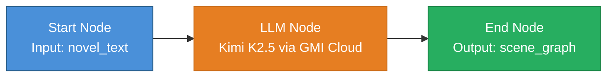
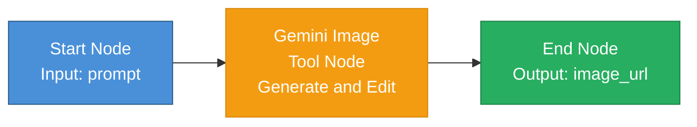
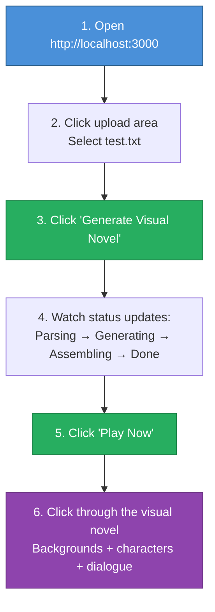
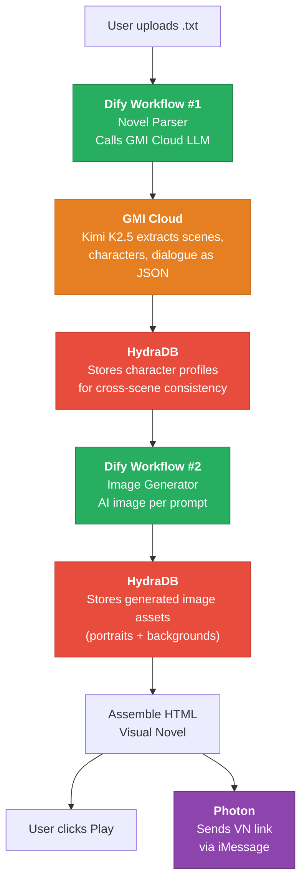
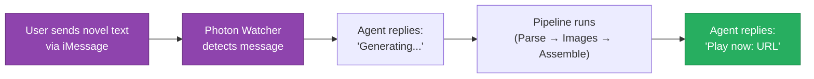

# Hongyang — Deployment Guide
# Hongyang — 部署指南

---

Test link 1 : http://localhost:3000/vn/b079be2d/index.html
http://localhost:3000/vn/b78faec4/index.html
http://localhost:3000/vn/5b5967b5/index.html
http://localhost:3000/vn/b079be2d/index.html

http://localhost:3000/vn/85a14b7c/index.html

---

## Table of Contents / 目录

- [1. Prerequisites / 前置条件](#1-prerequisites--前置条件)
- [2. Get API Keys / 获取 API 密钥](#2-get-api-keys--获取-api-密钥)
  - [2.1. GMI Cloud](#21-gmi-cloud)
  - [2.2. Dify](#22-dify)
  - [2.3. HydraDB](#23-hydradb)
  - [2.4. Photon](#24-photon)
- [3. Set Up Dify Workflows / 搭建 Dify 工作流](#3-set-up-dify-workflows--搭建-dify-工作流)
  - [3.1. Workflow #1: Novel Parser / 工作流 #1：小说解析器](#31-workflow-1-novel-parser--工作流-1小说解析器)
  - [3.2. Workflow #2: Image Generator (Gemini Tool Node) / 工作流 #2：图像生成器（Gemini 工具节点）](#32-workflow-2-image-generator-gemini-tool-node--工作流-2图像生成器gemini-工具节点)
  - [3.3. Why Two Workflows? / 为什么是两个工作流？](#33-why-two-workflows--为什么是两个工作流)
- [4. Configure Environment / 配置环境变量](#4-configure-environment--配置环境变量)
- [5. Install & Run / 安装与运行](#5-install--run--安装与运行)
- [6. Verify It Works / 验证是否正常运行](#6-verify-it-works--验证是否正常运行)
  - [6.1. Smoke Test Flow / 冒烟测试流程](#61-smoke-test-flow--冒烟测试流程)
  - [6.2. Expected Console Output / 预期控制台输出](#62-expected-console-output--预期控制台输出)
- [7. Troubleshooting / 故障排查](#7-troubleshooting--故障排查)
- [8. Architecture Quick Reference / 架构快速参考](#8-architecture-quick-reference--架构快速参考)

---

## 1. Prerequisites / 前置条件

Make sure the following are installed on your machine before starting.

在开始之前，请确保你的机器上已安装以下工具。

| Tool | Minimum Version | Check Command |
|------|----------------|---------------|
| Node.js | 22.16+ | `node -v` |
| npm | 10+ | `npm -v` |
| Git | any | `git --version` |

```bash
# Quick check — run all three at once
node -v && npm -v && git --version
```

If Node.js is not installed, get it from https://nodejs.org (LTS version recommended).

如果未安装 Node.js，请从 https://nodejs.org 获取（推荐 LTS 版本）。

---

## 2. Get API Keys / 获取 API 密钥

You need keys from 3 sponsor services. Photon is open-source and does not require an API key. All services offer free hackathon access.

你需要从3个赞助商服务获取密钥。Photon 是开源项目，不需要 API 密钥。所有服务均提供免费的黑客松使用权限。

### 2.1. GMI Cloud

GMI Cloud provides the LLM (Kimi K2.5) and image generation API.

GMI Cloud 提供 LLM（Kimi K2.5）和图像生成 API。

1. Go to https://console.gmicloud.ai/model-library
2. Log in with **GitHub**
3. Apply the hackathon voucher code: `KIMIAGENT` (gives you $20 in free credits for Kimi models)
4. Navigate to **API Keys** → Create a new key
5. Copy the key — it looks like a JWT token starting with `eyJ...`

步骤：
1. 访问 https://console.gmicloud.ai/model-library
2. 使用 **GitHub** 登录
3. 输入黑客松优惠码：`KIMIAGENT`（获得 $20 的 Kimi 模型免费额度）
4. 进入 **API Keys** → 创建新密钥
5. 复制密钥——格式为以 `eyJ...` 开头的 JWT 令牌

### 2.2. Dify

Dify provides the workflow orchestration layer.

Dify 提供工作流编排层。

1. Go to https://cloud.dify.ai/apps
2. Log in with **Google**
3. Apply the hackathon promo code: `6FDUU2I9` (gives you Dify Pro access)
4. The API key will be created when you set up the workflow (see [Section 3](#3-set-up-dify-workflow--搭建-dify-工作流))

步骤：
1. 访问 https://cloud.dify.ai/apps
2. 使用 **Google** 登录
3. 输入黑客松优惠码：`6FDUU2I9`（获得 Dify Pro 使用权限）
4. 搭建工作流时会自动创建 API 密钥（见[第3节](#3-set-up-dify-workflow--搭建-dify-工作流)）

### 2.3. HydraDB

HydraDB provides the memory layer for character consistency.

HydraDB 提供用于角色一致性的记忆层。

1. Go to https://app.hydradb.com/keys
2. Log in with **Google**
3. Hackathon access is pre-activated (no promo code needed)
4. Navigate to **API Keys** → Copy your key — it starts with `sk_live_...`

步骤：
1. 访问 https://app.hydradb.com/keys
2. 使用 **Google** 登录
3. 黑客松使用权限已预先激活（不需要优惠码）
4. 进入 **API Keys** → 复制密钥——格式以 `sk_live_...` 开头

### 2.4. Photon

Photon provides **iMessage delivery** via the open-source `@photon-ai/imessage-kit` SDK. No API key or account registration is required — it runs locally on your Mac.

Photon 通过开源的 `@photon-ai/imessage-kit` SDK 提供 **iMessage 交付**。不需要 API 密钥或注册账户——它在你的 Mac 上本地运行。

Reference repos:
- https://github.com/photon-hq/imessage-kit — iMessage SDK (v2.1.2, 1.2k stars)
- https://github.com/photon-hq/skills — Agent skills registry

**Prerequisites / 前提条件:**
1. **macOS only** — iMessage requires a Mac with an active iMessage account
2. **Full Disk Access** — Go to System Settings → Privacy & Security → Full Disk Access → add your terminal app (Terminal, iTerm2, VS Code, etc.)
3. **Set recipient** — In `.env`, set `PHOTON_RECIPIENT` to a phone number (e.g., `+1234567890`) or email address to receive the VN link via iMessage

步骤：
1. **仅限 macOS** — iMessage 需要已登录 iMessage 账户的 Mac
2. **完全磁盘访问权限** — 前往 系统设置 → 隐私与安全 → 完全磁盘访问权限 → 添加你的终端应用（Terminal、iTerm2、VS Code 等）
3. **设置接收者** — 在 `.env` 中，将 `PHOTON_RECIPIENT` 设为电话号码（如 `+1234567890`）或邮箱地址

Photon delivery is **non-blocking** — if it fails or no recipient is configured, the web UI path still works perfectly.

Photon 交付是**非阻塞的**——如果失败或未配置接收者，Web UI 路径仍然完全正常工作。

---

## 3. Set Up Dify Workflows / 搭建 Dify 工作流

Hongyang uses **two Dify workflows**: one for novel parsing (LLM), one for image generation. Both show Dify's orchestration capabilities to the Dify judge.

Hongyang 使用**两个 Dify 工作流**：一个用于小说解析（LLM），一个用于图像生成。两者都向 Dify 评审展示 Dify 的编排能力。

### 3.1. Workflow #1: Novel Parser / 工作流 #1：小说解析器



Follow these steps in the Dify web editor:

在 Dify 网页编辑器中按以下步骤操作：

**Step 1: Create a new Workflow App / 创建新工作流应用**

1. Go to https://cloud.dify.ai/apps
2. Click **"Create from Blank"** → select **"Workflow"**
3. Name it `Hongyang Novel Parser`

步骤：
1. 访问 https://cloud.dify.ai/apps
2. 点击 **"从空白创建"** → 选择 **"工作流"**
3. 命名为 `Hongyang Novel Parser`

**Step 2: Configure the Start Node / 配置开始节点**

1. Click the **Start** node
2. Add an input variable: name = `novel_text`, type = `Paragraph`

步骤：
1. 点击 **开始** 节点
2. 添加输入变量：名称 = `novel_text`，类型 = `段落（Paragraph）`

**Step 3: Add an LLM Node / 添加 LLM 节点**

1. Drag an **LLM** node onto the canvas
2. Connect Start → LLM
3. **Model provider**: Click "Add Model Provider" → select **OpenAI-API-compatible** → configure:
   - Provider name: `GMI Cloud`
   - API Base: `https://api.gmi-serving.com/v1`
   - API Key: *(paste your GMI API key)*
   - Model name: `moonshotai/Kimi-K2.5`
4. **System prompt**: Paste the following:

步骤：
1. 拖拽一个 **LLM** 节点到画布上
2. 连接 开始 → LLM
3. **模型提供商**：点击"添加模型提供商" → 选择 **OpenAI-API-compatible** → 配置：
   - 提供商名称：`GMI Cloud`
   - API 基地址：`https://api.gmi-serving.com/v1`
   - API 密钥：*（粘贴你的 GMI API 密钥）*
   - 模型名称：`moonshotai/Kimi-K2.5`
4. **系统提示词**：粘贴以下内容：

```
You are a visual novel director. Given novel text, extract a structured scene graph as JSON.

## JSON Schema
{
  "title": "string",
  "characters": [{
    "id": "char_XX", "name": "string",
    "description": "detailed physical appearance + personality",
    "image_prompt": "anime style portrait prompt with visual details"
  }],
  "scenes": [{
    "id": "scene_XX",
    "location": "string",
    "time_of_day": "morning|afternoon|evening|night|twilight",
    "mood": "tense|romantic|calm|action|mysterious|sad|joyful",
    "background_prompt": "anime style 16:9 background prompt",
    "dialogue": [{ "speaker": "char_XX or narrator", "text": "string" }],
    "next_scene": "scene_XX or null"
  }]
}

## Rules
- 5-8 scenes max. LINEAR progression, no branching.
- 3-8 dialogue lines per scene.
- Character descriptions CONSISTENT across scenes.
- image_prompt fields: "anime style" + enough visual detail.
- Output ONLY valid JSON. No markdown, no explanation.
```

5. **User message**: Set to the variable `{{novel_text}}`
6. **Response format**: Enable JSON mode if available

5. **用户消息**：设置为变量 `{{novel_text}}`
6. **响应格式**：如果可用，启用 JSON 模式

**Step 4: Add End Node / 添加结束节点**

1. Drag an **End** node onto the canvas
2. Connect LLM → End
3. Add an output variable: name = `scene_graph`, value = the LLM node's output text

步骤：
1. 拖拽一个 **结束** 节点到画布上
2. 连接 LLM → 结束
3. 添加输出变量：名称 = `scene_graph`，值 = LLM 节点的输出文本

**Step 5: Publish & Get API Key / 发布并获取 API 密钥**

1. Click **"Publish"** in the top-right corner
2. Go to **"API Access"** (left sidebar) → Copy the **API Key** (starts with `app-...`)
3. This key goes into `DIFY_API_KEY` in `.env`

步骤：
1. 点击右上角的 **"发布"**
2. 进入 **"API 访问"**（左侧边栏）→ 复制 **API 密钥**（以 `app-...` 开头）
3. 此密钥填入 `.env` 中的 `DIFY_API_KEY`

### 3.2. Workflow #2: Image Generator (Gemini Tool Node) / 工作流 #2：图像生成器（Gemini 工具节点）

This is a **separate Dify app** that generates AI images from a text prompt. It uses a **Gemini Image tool node** directly — the simplest and most reliable approach. No Agent reasoning overhead, no `query` configuration issues. Just prompt in, image out.

这是一个**独立的 Dify 应用**，根据文本提示词生成 AI 图片。它直接使用 **Gemini Image 工具节点**——最简单、最可靠的方案。没有 Agent 推理开销，没有 `query` 配置问题。提示词进去，图片出来。



**Step 1: Create a new Workflow App / 创建新工作流应用**

1. Go to https://cloud.dify.ai/apps
2. Click **"Create from Blank"** → select **"Workflow"**
3. Name it `Hongyang Image Generator`

步骤：
1. 访问 https://cloud.dify.ai/apps
2. 点击 **"从空白创建"** → 选择 **"工作流"**
3. 命名为 `Hongyang Image Generator`

**Step 2: Configure the Start Node / 配置开始节点**

1. Click the **Start** node
2. Add an input variable: name = `prompt`, type = `Paragraph`

步骤：
1. 点击 **开始** 节点
2. 添加输入变量：名称 = `prompt`，类型 = `段落（Paragraph）`

**Step 3: Add a Gemini Image Tool Node / 添加 Gemini Image 工具节点**

1. In the left toolbar, click the **"+"** button or drag from the node palette
2. Select **"Tool"** → search for **"Gemini Image"** → select **"Gemini Image Generate and Edit"**
3. Connect Start → Gemini Image tool node
4. Configure the tool node's input (right panel):
   - **prompt** field: paste the following prefix **before** the variable, then append `{{#start.prompt#}}`:

4. 配置工具节点的输入（右侧面板）：
   - **prompt** 字段：将以下前缀粘贴在变量**之前**，然后追加 `{{#start.prompt#}}`：

```
Generate this image immediately without asking any follow-up questions. Do not ask for clarification. Just generate the image directly based on this description: {{#start.prompt#}}
```

This prefix prevents Gemini from replying with follow-up questions like "What style would you like?" and forces it to generate the image in a single pass.

此前缀可防止 Gemini 回复后续问题（如"你想要什么风格？"），强制其一次性直接生成图片。

步骤：
1. 在左侧工具栏，点击 **"+"** 按钮或从节点面板拖拽
2. 选择 **"工具（Tool）"** → 搜索 **"Gemini Image"** → 选择 **"Gemini Image Generate and Edit"**
3. 连接 开始 → Gemini Image 工具节点
4. 配置工具节点的输入（右侧面板）：
   - **prompt** 字段：粘贴 `Generate this image immediately without asking any follow-up questions. Do not ask for clarification. Just generate the image directly based on this description: ` 然后点击 `{x}` 追加变量 `{{#start.prompt#}}`

> **Prerequisite:** The Gemini Image plugin must be installed and a Google AI API key must be configured. Go to **Dify → Plugins** → install **Gemini Image Generate and Edit** if not already installed. Then go to **Settings → Model Providers → Google** and add your Google AI API key.

> **前提条件：** 必须安装 Gemini Image 插件并配置 Google AI API 密钥。前往 **Dify → Plugins** → 如果尚未安装，安装 **Gemini Image Generate and Edit**。然后前往 **Settings → Model Providers → Google** 添加你的 Google AI API 密钥。

**Step 4: Add End (Output) Node & Select the Right Variable / 添加结束（Output）节点并选择正确的变量**

1. Drag an **End / Output** node onto the canvas
2. Connect Gemini Image → Output
3. Click the Output node. In the right panel under **OUTPUT VARIABLE**:
   - Name: `image_url`
   - Type: `Array[file]`
4. Click the variable value field → you'll see a dropdown with available variables. The Gemini Image node exposes three outputs:

点击 Output 节点。在右侧面板的 **OUTPUT VARIABLE** 下方：
   - 名称：`image_url`
   - 类型：`Array[file]`
4. 点击变量值字段 → 你会看到一个下拉列表，显示可用变量。Gemini Image 节点暴露三个输出：

| Variable | Type | What it contains | Use this? |
|----------|------|-----------------|-----------|
| `GEMINI IMAGE GENERATE A... > text` | String | NULL — Gemini Image returns no text | No |
| `GEMINI IMAGE GENERATE A... > files` | Array[file] | The generated image files with URLs | **YES — select this one** |
| `GEMINI IMAGE GENERATE A... > json` | Array[object] | NULL — Gemini Image returns no JSON | No |

| 变量 | 类型 | 内容 | 是否选择？ |
|------|------|------|-----------|
| `GEMINI IMAGE GENERATE A... > text` | String | NULL——Gemini Image 不返回文本 | 否 |
| `GEMINI IMAGE GENERATE A... > files` | Array[file] | 生成的图片文件（含 URL）| **是——选择这个** |
| `GEMINI IMAGE GENERATE A... > json` | Array[object] | NULL——Gemini Image 不返回 JSON | 否 |

5. Select **`GEMINI IMAGE GENERATE A... > files`** — this is the only output that contains actual data. The `text` and `json` fields are NULL for the Gemini Image tool.

5. 选择 **`GEMINI IMAGE GENERATE A... > files`** —— 这是唯一包含实际数据的输出。Gemini Image 工具的 `text` 和 `json` 字段为 NULL。

The final Output node should show: `image_url` / `{x} Gemini Image Gener...` `{x} Array...`

最终 Output 节点应显示：`image_url` / `{x} Gemini Image Gener...` `{x} Array...`

步骤：
1. 拖拽一个 **结束 / Output** 节点到画布上
2. 连接 Gemini Image → Output
3. 在 OUTPUT VARIABLE 中添加变量名 `image_url`，类型 `Array[file]`
4. 点击值字段 → 从下拉列表中选择 **`GEMINI IMAGE GENERATE A... > files`**
5. 确认显示为：`image_url` / `{x} Gemini Image Gener...` `{x} Array...`

**Step 5: Publish & Get API Key / 发布并获取 API 密钥**

1. Click **"Publish"** in the top-right corner
2. Go to **"API Access"** (left sidebar) → Copy the **API Key** (starts with `app-...`)
3. This key goes into `DIFY_IMAGE_API_KEY` in `.env`

步骤：
1. 点击右上角的 **"发布"**
2. 进入 **"API 访问"**（左侧边栏）→ 复制 **API 密钥**（以 `app-...` 开头）
3. 此密钥填入 `.env` 中的 `DIFY_IMAGE_API_KEY`

### 3.3. Why Two Workflows? / 为什么是两个工作流？

Each Dify workflow is a separate app with its own API key. This is by design — it shows Dify judges that you understand Dify's modular workflow architecture. The code calls each workflow independently: the parser runs once per upload, the image generator runs once per scene/character (5-15 calls).

每个 Dify 工作流是一个独立的应用，有自己的 API 密钥。这是有意为之——向 Dify 评审展示你理解 Dify 的模块化工作流架构。代码独立调用每个工作流：解析器每次上传运行一次，图像生成器每个场景/角色运行一次（5-15次调用）。

The Image Generator uses a **Gemini tool node directly** because:
- It's the **fastest and most reliable** path — no Agent reasoning overhead
- Direct tool nodes avoid `query` config errors that Agent nodes can have
- It still shows Dify's plugin ecosystem (Gemini Image) and workflow orchestration to judges
- The Dify workflow orchestrates the call; GMI Cloud LLM generates the prompt — both sponsors are showcased

图像生成器直接使用 **Gemini 工具节点**，原因是：
- 这是**最快、最可靠**的路径——没有 Agent 推理开销
- 直接工具节点避免了 Agent 节点可能出现的 `query` 配置错误
- 它仍然向评审展示了 Dify 的插件生态（Gemini Image）和工作流编排能力
- Dify 工作流编排调用；GMI Cloud LLM 生成提示词——两个赞助商都得到了展示

---

## 4. Configure Environment / 配置环境变量

Navigate to the `hongyang/` project directory and edit the `.env` file with your real keys:

进入 `hongyang/` 项目目录，用你的真实密钥编辑 `.env` 文件：

```bash
cd '/Users/barack/Library/CloudStorage/OneDrive-Personal/251206-Meetup-Luma-Eventbrite-线下-活动/260328-Total Agent Recall/hongyang'
```

Edit `.env` to contain:

编辑 `.env` 文件，内容如下：

```bash
# === GMI Cloud (Inference: LLM) ===
GMI_API_KEY=eyJhbGciOiJIUz...YOUR_FULL_JWT_TOKEN
GMI_API_BASE=https://api.gmi-serving.com/v1
GMI_MODEL=moonshotai/Kimi-K2.5

# === Dify (Workflow Orchestration) ===
# App #1: Novel Parser workflow
DIFY_API_KEY=app-YOUR_PARSER_WORKFLOW_KEY
DIFY_API_BASE=https://api.dify.ai/v1
# App #2: Image Generator workflow
DIFY_IMAGE_API_KEY=app-YOUR_IMAGE_WORKFLOW_KEY

# === HydraDB (Memory Layer) ===
HYDRADB_API_KEY=sk_live_YOUR_HYDRADB_KEY_HERE
HYDRADB_API_BASE=https://api.hydradb.com/v1

# === Photon / iMessage Kit (Messaging Delivery) ===
# Uses @photon-ai/imessage-kit to send iMessages on macOS.
# Set to a phone number or email to receive the VN link via iMessage.
# Leave empty to skip iMessage delivery (web UI still works).
PHOTON_RECIPIENT=+1234567890

# === Server ===
PORT=3000
```

**Important notes:**
- The GMI API key is a JWT token (long string starting with `eyJ`). Paste the entire token with no spaces.
- The GMI API base URL is `api.gmi-serving.com` (NOT `api.gmicloud.ai`).
- You need **two** Dify API keys — one per workflow app (parser + image generator).

**重要说明：**
- GMI API 密钥是一个 JWT 令牌（以 `eyJ` 开头的长字符串）。粘贴时确保完整，不要有空格。
- GMI API 基地址是 `api.gmi-serving.com`（不是 `api.gmicloud.ai`）。
- 你需要**两个** Dify API 密钥——每个工作流应用一个（解析器 + 图像生成器）。

---

## 5. Install & Run / 安装与运行

```bash
# 1. Navigate to project
cd '/Users/barack/Library/CloudStorage/OneDrive-Personal/251206-Meetup-Luma-Eventbrite-线下-活动/260328-Total Agent Recall/hongyang'

# 2. Install dependencies
npm install

# 3. Verify TypeScript compiles
npx tsc --noEmit

# 4. Kill any old process on port 3000 (IMPORTANT — do this every time before starting)
lsof -ti:3000 | xargs kill -9 2>/dev/null; echo "Port 3000 cleared"

# 5. Start the server
npm run dev
```

You should see:

你应该看到：

```
╔══════════════════════════════════════════════╗
║                                              ║
║   🎮  HONGYANG — Visual Novel Agent          ║
║                                              ║
║   http://localhost:3000                      ║
║                                              ║
║   Sponsor stack:                             ║
║   • GMI Cloud (Kimi K2.5 LLM)                 ║
║   • Dify (Parser + Image Gen Workflows)       ║
║   • HydraDB (Memory Layer)                   ║
║   • Photon (Discord Delivery)                ║
║                                              ║
╚══════════════════════════════════════════════╝
```

> **If you see `EADDRINUSE: address already in use :::3000`**, it means a previous server is still running. Run this first:
> ```bash
> lsof -ti:3000 | xargs kill -9
> ```
> Then run `npm run dev` again.

> **如果看到 `EADDRINUSE: address already in use :::3000`**，说明之前的服务器还在运行。先运行：
> ```bash
> lsof -ti:3000 | xargs kill -9
> ```
> 然后再次运行 `npm run dev`。

Open your browser and go to **http://localhost:3000**. You should see the Hongyang upload page.

打开浏览器，访问 **http://localhost:3000**。你应该看到 Hongyang 上传页面。

---

## 6. Verify It Works / 验证是否正常运行

### 6.1. Smoke Test Flow / 冒烟测试流程

Create a test file called `test.txt` with a short novel excerpt (~300 words). Here's a ready-to-use sample:

创建一个名为 `test.txt` 的测试文件，包含一段简短的小说节选（约300词）。以下是一个可直接使用的示例：

```text
The old lighthouse stood at the edge of the cliff, its beacon long extinguished.
Elena pulled her dark cloak tighter as the wind howled across the rocky shore.

"Are you sure about this?" Marcus asked, his voice barely audible over the crashing waves.
The tall man adjusted his glasses nervously, his brown coat flapping in the gale.

Elena nodded, her silver hair whipping across her face. "The map leads here.
If the artifact exists, it's inside that lighthouse."

They approached the rusted iron door. Marcus produced an old brass key from his pocket.
With a grinding screech, the lock turned and the door swung inward, revealing a spiral
staircase descending into darkness.

"Ladies first?" Marcus offered with a weak smile.

"Coward," Elena smirked, pulling a lantern from her pack. The warm light pushed back
the shadows, revealing walls covered in strange symbols.

As they descended, the air grew cold and damp. At the bottom, they found a circular
chamber with a pedestal in its center. On it rested a crystal orb that pulsed with
a faint blue light.

"There it is," Elena whispered. "The Heart of the Storm."

Marcus reached for it, but Elena caught his wrist. "Wait. Look at the floor."

Around the pedestal, barely visible in the lantern light, was a ring of ancient runes
that glowed with a warning red. One wrong step, and they both knew there would be
no going back.
```

Then follow these steps:

然后按以下步骤操作：



1. Open **http://localhost:3000**
2. Click the upload area → select your `test.txt`
3. Click **"Generate Visual Novel"**
4. Wait for the pipeline to complete (status updates appear in real-time)
5. Click **"Play Now"** when the link appears
6. Click through the visual novel — you should see backgrounds, characters, and dialogue

步骤：
1. 打开 **http://localhost:3000**
2. 点击上传区域 → 选择你的 `test.txt`
3. 点击 **"Generate Visual Novel"**
4. 等待流水线完成（状态更新会实时显示）
5. 链接出现后点击 **"Play Now"**
6. 点击浏览视觉小说——你应该看到背景图、角色立绘和对话文本

### 6.2. Expected Console Output / 预期控制台输出

While the pipeline runs, your terminal should show something like:

流水线运行时，你的终端应该显示类似以下内容：

```
=== Pipeline started for job a1b2c3d4 ===
[HydraDB] Stored 2 character profiles.
[novel-parser] Extracted 6 scenes, 2 characters.
[image-gen] Generating portrait for Elena...
[image-gen] Generating portrait for Marcus...
[image-gen] Generating background for scene_01: Cliff edge near old lighthouse...
[image-gen] Generating background for scene_02: Inside the lighthouse entrance...
...
[image-gen] Done. 2 portraits + 6 backgrounds.
[HydraDB] Stored 8 image assets (2 portraits + 6 backgrounds).
[vn-assembler] Written to output/a1b2c3d4/index.html
[Photon] iMessage sent to +1234567890.   ← Or "No PHOTON_RECIPIENT configured" if not set
=== Pipeline complete for job a1b2c3d4 → /vn/a1b2c3d4/index.html ===
```

The `[HydraDB] Stored ... image assets` line confirms that all generated images (character portraits and scene backgrounds) are persisted to HydraDB. You can verify this by going to https://app.hydradb.com/knowledge → selecting the `hongyang` tenant → you should see both character profiles and image assets listed.

`[HydraDB] Stored ... image assets` 这行确认所有生成的图片（角色立绘和场景背景）已持久化到 HydraDB。你可以在 https://app.hydradb.com/knowledge → 选择 `hongyang` 租户 → 查看角色档案和图片资产。

The `[Photon] Failed` warning is **expected** if you haven't configured Photon. The web UI works independently.

`[Photon] Failed` 警告是**预期的**，如果你没有配置 Photon。Web UI 独立运行，不受影响。

---

## 7. Troubleshooting / 故障排查

| Symptom | Cause | Fix |
|---------|-------|-----|
| `npm run dev` fails with "Cannot find module 'dotenv'" | Dependencies not installed | Run `npm install` |
| `npm run dev` fails with TypeScript error | Wrong Node version | Ensure `node -v` is 22.16+ |
| Status stuck at "Parsing novel..." | Dify workflow not configured or wrong API key | Check that: (1) Dify workflow is published, (2) `DIFY_API_KEY` in `.env` matches the API Access page, (3) the workflow has an input named `novel_text` and output named `scene_graph` |
| Status stuck at "Parsing..." and console shows "Dify workflow failed, falling back to direct GMI Cloud call" | Dify issue, but GMI fallback should work | Check `GMI_API_KEY` is correct. The app auto-falls back to calling GMI Cloud directly. |
| All images show as gray placeholders | Dify Image workflow failed + fallback also failed | Check `DIFY_IMAGE_API_KEY` in `.env`. If not set, the app falls back to pollinations.ai. Placeholder means all paths failed — VN is still playable. |
| "[HydraDB] Failed to store character" | HydraDB key expired or wrong | Verify key at https://app.hydradb.com/keys. App still works — just without memory-based character consistency. |
| "[HydraDB] Failed to store assets" | Knowledge upload failed | Assets are stored as knowledge via `POST /ingestion/upload_knowledge` (multipart form, field `app_sources`). Verify API key and that tenant `hongyang` exists. |
| "[Photon] No PHOTON_RECIPIENT configured" | No recipient set | Set `PHOTON_RECIPIENT` in `.env` to a phone number or email. Leave empty to skip iMessage delivery. |
| "[Photon] Failed to send iMessage" | iMessage delivery failed | Ensure: (1) macOS with active iMessage account, (2) Full Disk Access granted to your terminal, (3) valid phone/email in `PHOTON_RECIPIENT`. App still works — web UI is independent. |
| VN page is blank after clicking Play | Scene graph JSON was malformed | Check console for JSON parse errors. Try a shorter, simpler text input. |
| Port 3000 already in use | Another process on 3000 | Change `PORT=3001` in `.env`, or kill the other process: `lsof -ti:3000 \| xargs kill` |

| 症状 | 原因 | 修复方法 |
|------|------|----------|
| `npm run dev` 报错 "Cannot find module 'dotenv'" | 未安装依赖 | 运行 `npm install` |
| `npm run dev` TypeScript 报错 | Node 版本不对 | 确保 `node -v` 是 22.16+ |
| 状态卡在"Parsing novel..." | Dify 工作流未配置或密钥错误 | 检查：(1) Dify 工作流已发布，(2) `.env` 中的 `DIFY_API_KEY` 与 API Access 页面匹配，(3) 工作流有名为 `novel_text` 的输入和 `scene_graph` 的输出 |
| 状态卡在"Parsing..."且控制台显示 Dify 失败回退 | Dify 有问题，但 GMI 回退应能工作 | 检查 `GMI_API_KEY` 是否正确。应用会自动回退到直接调用 GMI Cloud。|
| 所有图片显示为灰色占位符 | Dify 图像工作流失败 + 回退也失败 | 检查 `.env` 中的 `DIFY_IMAGE_API_KEY`。未设置时应用回退到 pollinations.ai。占位符说明所有路径均失败——VN 仍可播放。|
| "[HydraDB] Failed to store character" | HydraDB 密钥过期或错误 | 在 https://app.hydradb.com/keys 验证密钥。应用仍可工作——只是没有基于记忆的角色一致性。|
| "[Photon] Failed to send message" | Photon 未配置时预期行为 | 这是正常的。Photon 是非阻塞的。Web UI 不受影响。|
| 点击 Play 后 VN 页面空白 | 场景图 JSON 格式错误 | 检查控制台的 JSON 解析错误。尝试更短、更简单的文本输入。|
| 端口 3000 已被占用 | 其他进程占用 3000 | 在 `.env` 中改为 `PORT=3001`，或终止其他进程：`lsof -ti:3000 \| xargs kill` |

---

## 8. Architecture Quick Reference / 架构快速参考

How every sponsor tool is used in Phase 1 — the answer for every judge:

每个赞助商工具在第一阶段的使用方式——对每位评审的回答：



| Judge asks... | Your answer |
|--------------|-------------|
| "How do you use **GMI Cloud**?" | "Kimi K2.5 powers the novel-to-scene-graph parsing — extracting characters, scenes, dialogue, and image prompts from raw text. All LLM inference runs on GMI Cloud via the OpenAI-compatible API." |
| "How do you use **Dify**?" | "We run two Dify workflows: Workflow #1 is the Novel Parser — it calls GMI Cloud's Kimi K2.5 to extract a structured scene graph. Workflow #2 is the Image Generator — it takes each image prompt and generates an AI image. Dify orchestrates the entire pipeline." |
| "How do you use **HydraDB**?" | "We use HydraDB as a full asset memory layer. After parsing, we store each character's visual profile with `memory.add()`. Before generating images, we recall profiles with `memory.recall()` to keep characters visually consistent. After image generation, we store all generated assets (portrait URLs + background URLs) back to HydraDB — so every artifact is persisted and queryable in the Knowledge dashboard." |
| "How do you use **Photon**?" | "We use Photon's `@photon-ai/imessage-kit` SDK for both **one-way delivery** and **two-way interaction**. After generating a VN, we send the link via `sdk.send()`. We also run `sdk.startWatching()` to listen for incoming iMessages — users can text a novel excerpt and receive a playable VN link back automatically. Zero API keys, fully open-source, runs on macOS." |

| 评审问… | 你的回答 |
|---------|---------|
| "你怎么用 **GMI Cloud**？" | "Kimi K2.5 驱动小说到场景图的解析——从原始文本中提取角色、场景、对话和图像提示词。所有 LLM 推理通过 OpenAI 兼容 API 在 GMI Cloud 上运行。" |
| "你怎么用 **Dify**？" | "我们运行两个 Dify 工作流：工作流 #1 是小说解析器——调用 GMI Cloud 的 Kimi K2.5 提取结构化场景图。工作流 #2 是图像生成器——将每个图像提示词生成 AI 图片。Dify 编排整个流水线。" |
| "你怎么用 **HydraDB**？" | "我们将 HydraDB 用作完整的资产记忆层。解析后，用 `memory.add()` 存入角色视觉档案。生成图片前，用 `memory.recall()` 召回档案以保持角色跨场景一致性。图片生成后，我们将所有生成的资产（立绘 URL + 背景 URL）也存回 HydraDB——这样每个产物都在 Knowledge 面板中持久化并可查询。" |
| "你怎么用 **Photon**？" | "我们使用 Photon 的 `@photon-ai/imessage-kit` SDK 实现**单向交付**和**双向交互**。生成 VN 后，通过 `sdk.send()` 发送链接。我们还运行 `sdk.startWatching()` 监听传入的 iMessage——用户可以发送小说文本，自动收到可玩的 VN 链接。零 API 密钥，完全开源，在 macOS 上运行。" |

---

## 9. Deploy to Vercel (Public URL) / 部署到 Vercel（公开链接）

Deploy the app online so anyone can use it — no local setup required for end users.

将应用部署到线上，任何人都可以使用——终端用户无需本地配置。

### 9.1. Deploy Steps / 部署步骤

1. Push the project to GitHub (the `.gitignore` already excludes `.env` and `node_modules/`)
2. Go to https://vercel.com/new → import your GitHub repository
3. Set **Root Directory** to `hongyang`
4. Add your **Environment Variables** (same keys as `.env`, excluding `PHOTON_RECIPIENT`):

步骤：
1. 将项目推送到 GitHub（`.gitignore` 已排除 `.env` 和 `node_modules/`）
2. 访问 https://vercel.com/new → 导入你的 GitHub 仓库
3. 设置 **Root Directory** 为 `hongyang`
4. 添加**环境变量**（与 `.env` 相同，不含 `PHOTON_RECIPIENT`）：

| Variable | Value |
|----------|-------|
| `GMI_API_KEY` | Your GMI Cloud JWT token |
| `GMI_API_BASE` | `https://api.gmi-serving.com/v1` |
| `GMI_MODEL` | `moonshotai/Kimi-K2.5` |
| `DIFY_API_KEY` | `app-...` (Novel Parser key) |
| `DIFY_API_BASE` | `https://api.dify.ai/v1` |
| `DIFY_IMAGE_API_KEY` | `app-...` (Image Generator key) |
| `HYDRADB_API_KEY` | `sk_live_...` |
| `HYDRADB_API_BASE` | `https://api.hydradb.com` |
| `HYDRADB_TENANT_ID` | `hongyang` |

5. Click **Deploy** → your app is live at `https://your-project.vercel.app`

5. 点击 **Deploy** → 你的应用在 `https://your-project.vercel.app` 上线

> **Note:** Photon iMessage delivery is automatically skipped on Vercel (requires macOS). The web UI works fully on its own.

> **注意：** Vercel 上 Photon iMessage 交付自动跳过（需要 macOS）。Web UI 完全独立工作。

### 9.2. How It Works on Vercel / Vercel 上的工作方式

On Vercel, the app runs as a serverless function (`maxDuration: 60s`):

- `/api/generate` runs the pipeline **synchronously** — waits for completion before responding
- VN HTML is stored **in memory** and served via `/api/vn/:id` (no disk writes needed)
- The frontend auto-detects the response mode and shows results immediately

在 Vercel 上，应用作为无服务器函数运行（`maxDuration: 60s`）：

- `/api/generate` **同步**运行流水线——等待完成后再响应
- VN HTML 存储在**内存**中，通过 `/api/vn/:id` 提供（无需磁盘写入）
- 前端自动检测响应模式并立即显示结果

> **Timeout:** Free plan allows 60 seconds. For longer novels, upgrade to Vercel Pro (300s) or use shorter input text.

> **超时：** 免费计划允许 60 秒。对于较长的小说，升级到 Vercel Pro（300 秒）或使用更短的输入文本。

---

## 10. Photon iMessage Watcher / Photon iMessage 监听器

Beyond one-way delivery, Hongyang uses Photon's `startWatching()` API for **two-way iMessage interaction**. Text a novel excerpt to this Mac → the agent generates a VN and replies with the playable link.

除了单向交付，Hongyang 还使用 Photon 的 `startWatching()` API 实现**双向 iMessage 交互**。向此 Mac 发送小说文本 → 智能体生成 VN 并回复可玩链接。



### 10.1. Setup / 配置

1. Set `PHOTON_RECIPIENT` in `.env` (phone number with country code, e.g. `+14251234567`)
2. Grant **Full Disk Access** to your terminal: System Settings → Privacy & Security → Full Disk Access
3. Start the server: `npm run dev`
4. You should see: `[Photon] iMessage watcher started`
5. Send a novel excerpt (50+ chars) via iMessage to this Mac

步骤：
1. 在 `.env` 中设置 `PHOTON_RECIPIENT`（含国家代码的手机号）
2. 为终端授予**完全磁盘访问权限**：系统设置 → 隐私与安全 → 完全磁盘访问
3. 启动服务器：`npm run dev`
4. 你应该看到：`[Photon] iMessage watcher started`
5. 通过 iMessage 向此 Mac 发送小说文本（50+ 字符）

### 10.2. Photon SDK Features Used / 使用的 Photon SDK 功能

| Feature | API | Purpose |
|---------|-----|---------|
| Send message | `sdk.send(to, text)` | Deliver VN link |
| Real-time watcher | `sdk.startWatching({ onDirectMessage })` | Listen for incoming novel text |
| Auto-reply | `sdk.send(msg.sender, reply)` | Reply with status + result |
| Message filtering | `msg.isFromMe`, `msg.isReaction` | Skip own messages and reactions |

> **Note:** The watcher only runs locally (macOS). On Vercel, it is automatically disabled.

> **注意：** 监听器仅在本地运行（macOS）。在 Vercel 上自动禁用。

---

*Deployment Guide for Hongyang — Total Agent Recall Hackathon, March 28, 2026*
*Hongyang 部署指南 — Total Agent Recall 黑客松，2026年3月28日*
