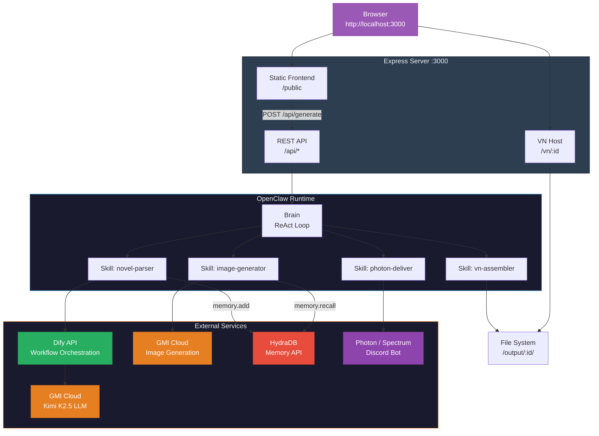
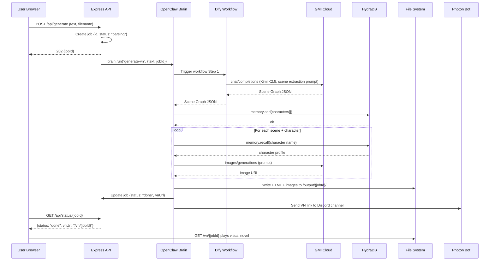
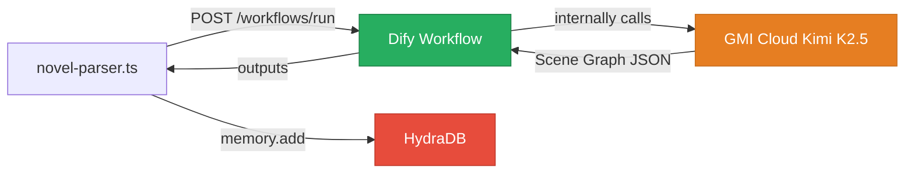

# Hongyang — Phase 1 Software Development Document
# Hongyang — 第一阶段软件开发文档

---

## Table of Contents / 目录

- [1. Document Scope / 文档范围](#1-document-scope--文档范围)
- [2. System Architecture / 系统架构](#2-system-architecture--系统架构)
  - [2.1. High-Level Architecture / 高层架构](#21-high-level-architecture--高层架构)
  - [2.2. Request Lifecycle / 请求生命周期](#22-request-lifecycle--请求生命周期)
- [3. Project Structure / 项目结构](#3-project-structure--项目结构)
  - [3.1. Directory Layout / 目录布局](#31-directory-layout--目录布局)
  - [3.2. Key Files / 关键文件说明](#32-key-files--关键文件说明)
- [4. Environment & Setup / 环境搭建](#4-environment--setup--环境搭建)
  - [4.1. Prerequisites / 前置依赖](#41-prerequisites--前置依赖)
  - [4.2. Environment Variables / 环境变量](#42-environment-variables--环境变量)
  - [4.3. Bootstrap Script / 启动脚本](#43-bootstrap-script--启动脚本)
- [5. Module Design / 模块设计](#5-module-design--模块设计)
  - [5.1. Web Frontend / Web 前端](#51-web-frontend--web-前端)
    - [5.1.1. Upload Page / 上传页面](#511-upload-page--上传页面)
    - [5.1.2. Player Page / 播放页面](#512-player-page--播放页面)
  - [5.2. API Layer / API 层](#52-api-layer--api-层)
    - [5.2.1. POST /api/generate](#521-post-apigenerate)
    - [5.2.2. GET /api/status/:id](#522-get-apistatusid)
    - [5.2.3. GET /vn/:id](#523-get-vnid)
  - [5.3. OpenClaw Agent / OpenClaw 智能体](#53-openclaw-agent--openclaw-智能体)
    - [5.3.1. Brain Configuration / Brain 配置](#531-brain-configuration--brain-配置)
    - [5.3.2. Skill Registry / 技能注册](#532-skill-registry--技能注册)
  - [5.4. Skill: novel-parser / 技能：novel-parser](#54-skill-novel-parser--技能novel-parser)
    - [5.4.1. Dify Workflow / Dify 工作流](#541-dify-workflow--dify-工作流)
    - [5.4.2. GMI Cloud LLM Call / GMI Cloud LLM 调用](#542-gmi-cloud-llm-call--gmi-cloud-llm-调用)
    - [5.4.3. Scene Graph Output Schema / 场景图输出模式](#543-scene-graph-output-schema--场景图输出模式)
  - [5.5. Skill: image-generator / 技能：image-generator](#55-skill-image-generator--技能image-generator)
    - [5.5.1. HydraDB Memory Recall / HydraDB 记忆召回](#551-hydradb-memory-recall--hydradb-记忆召回)
    - [5.5.2. Image Prompt Construction / 图像提示词构建](#552-image-prompt-construction--图像提示词构建)
    - [5.5.3. GMI Cloud Image API / GMI Cloud 图像 API](#553-gmi-cloud-image-api--gmi-cloud-图像-api)
  - [5.6. Skill: vn-assembler / 技能：vn-assembler](#56-skill-vn-assembler--技能vn-assembler)
    - [5.6.1. HTML Template / HTML 模板](#561-html-template--html-模板)
    - [5.6.2. Scene Rendering Logic / 场景渲染逻辑](#562-scene-rendering-logic--场景渲染逻辑)
  - [5.7. Skill: photon-deliver / 技能：photon-deliver](#57-skill-photon-deliver--技能photon-deliver)
  - [5.8. HydraDB Memory Layer / HydraDB 记忆层](#58-hydradb-memory-layer--hydradb-记忆层)
    - [5.8.1. Memory Schema / 记忆模式](#581-memory-schema--记忆模式)
    - [5.8.2. Write Path / 写入路径](#582-write-path--写入路径)
    - [5.8.3. Read Path / 读取路径](#583-read-path--读取路径)
- [6. Data Models / 数据模型](#6-data-models--数据模型)
  - [6.1. Scene Graph JSON / 场景图 JSON](#61-scene-graph-json--场景图-json)
  - [6.2. Generation Job / 生成任务](#62-generation-job--生成任务)
- [7. Prompt Engineering / 提示词工程](#7-prompt-engineering--提示词工程)
  - [7.1. Scene Extraction System Prompt / 场景提取系统提示词](#71-scene-extraction-system-prompt--场景提取系统提示词)
  - [7.2. Image Prompt Template / 图像提示词模板](#72-image-prompt-template--图像提示词模板)
- [8. Error Handling / 错误处理](#8-error-handling--错误处理)
- [9. Implementation Checklist / 实现检查清单](#9-implementation-checklist--实现检查清单)

---

## 1. Document Scope / 文档范围

This SDD covers **Phase 1 only** — the Full-Stack MVP that must be built in ~60 minutes. Phase 1 integrates ALL sponsor tools (GMI Cloud, Dify, HydraDB, Photon) so the project qualifies for every hackathon prize track even if subsequent phases are not completed. All code is Node.js/TypeScript running on `localhost:3000`.

本 SDD **仅覆盖第一阶段** —— 需要在约60分钟内构建的全栈 MVP。第一阶段集成所有赞助商工具（GMI Cloud、Dify、HydraDB、Photon），因此即使后续阶段未完成，项目也能获得所有黑客松奖项赛道的参赛资格。全部代码为 Node.js/TypeScript，运行在 `localhost:3000`。

---

## 2. System Architecture / 系统架构

### 2.1. High-Level Architecture / 高层架构



### 2.2. Request Lifecycle / 请求生命周期

The complete lifecycle of a single generation request, from file upload to playable visual novel:

一次生成请求的完整生命周期，从文件上传到可玩的视觉小说：



---

## 3. Project Structure / 项目结构

### 3.1. Directory Layout / 目录布局

```
hongyang/
├── package.json
├── tsconfig.json
├── .env                          # API keys (never commit)
├── src/
│   ├── server.ts                 # Express entry point, starts on :3000
│   ├── state.ts                  # In-memory job store
│   ├── api/
│   │   ├── generate.ts           # POST /api/generate handler
│   │   └── status.ts             # GET /api/status/:id handler
│   ├── agent/
│   │   ├── brain.ts              # OpenClaw Brain init + pipeline
│   │   └── skills/
│   │       ├── novel-parser.ts   # Skill: Dify + GMI Cloud LLM
│   │       ├── image-generator.ts# Skill: HydraDB recall + GMI Cloud image
│   │       ├── vn-assembler.ts   # Skill: HTML generation
│   │       └── photon-deliver.ts # Skill: Photon/Spectrum bot
│   ├── services/
│   │   ├── gmi-cloud.ts          # GMI Cloud API wrapper
│   │   ├── dify.ts               # Dify workflow API wrapper
│   │   ├── hydradb.ts            # HydraDB memory API wrapper
│   │   └── photon.ts             # Photon/Spectrum SDK wrapper
│   ├── templates/
│   │   └── vn-player.html        # Visual novel HTML Handlebars template
│   └── types/
│       └── scene-graph.ts        # TypeScript interfaces
├── public/
│   ├── index.html                # Upload page
│   └── style.css                 # Minimal styling
└── output/                       # Generated VNs (gitignored)
    └── {jobId}/
        ├── index.html            # Playable VN
        └── assets/               # (reserved for P2 local assets)
```

### 3.2. Key Files / 关键文件说明

| File | Purpose | Sponsor Tool |
|------|---------|-------------|
| `src/server.ts` | Express server, serves static files + API + VN output | — |
| `src/agent/brain.ts` | Initializes OpenClaw, registers 4 skills, runs pipeline | OpenClaw |
| `src/agent/skills/novel-parser.ts` | Calls Dify workflow → GMI Cloud LLM → returns scene graph | **Dify + GMI Cloud** |
| `src/agent/skills/image-generator.ts` | Recalls HydraDB memory → calls GMI Cloud image gen | **HydraDB + GMI Cloud** |
| `src/agent/skills/vn-assembler.ts` | Builds self-contained HTML visual novel file | — |
| `src/agent/skills/photon-deliver.ts` | Sends VN link to Discord via Photon/Spectrum | **Photon** |
| `src/templates/vn-player.html` | Handlebars template for visual novel player | — |

| 文件 | 用途 | 赞助商工具 |
|------|------|-----------|
| `src/server.ts` | Express 服务器，提供静态文件 + API + VN 输出 | — |
| `src/agent/brain.ts` | 初始化 OpenClaw，注册4个技能，运行流水线 | OpenClaw |
| `src/agent/skills/novel-parser.ts` | 调用 Dify 工作流 → GMI Cloud LLM → 返回场景图 | **Dify + GMI Cloud** |
| `src/agent/skills/image-generator.ts` | 召回 HydraDB 记忆 → 调用 GMI Cloud 图像生成 | **HydraDB + GMI Cloud** |
| `src/agent/skills/vn-assembler.ts` | 构建自包含的 HTML 视觉小说文件 | — |
| `src/agent/skills/photon-deliver.ts` | 通过 Photon/Spectrum 将 VN 链接发送到 Discord | **Photon** |
| `src/templates/vn-player.html` | 视觉小说播放器的 Handlebars 模板 | — |

---

## 4. Environment & Setup / 环境搭建

### 4.1. Prerequisites / 前置依赖

```
Node.js  ≥ 22.16
npm      ≥ 10
OpenClaw latest    →  npm install -g openclaw@latest
```

### 4.2. Environment Variables / 环境变量

```bash
# .env
GMI_API_KEY=gmi_xxxxxxxxxxxxx
GMI_API_BASE=https://api.gmicloud.ai/v1

DIFY_API_KEY=app-xxxxxxxxxxxxx
DIFY_API_BASE=https://api.dify.ai/v1

HYDRADB_API_KEY=hdb_xxxxxxxxxxxxx
HYDRADB_API_BASE=https://api.hydradb.com/v1

PHOTON_API_KEY=ph_xxxxxxxxxxxxx
PHOTON_CHANNEL=discord
PHOTON_CHANNEL_ID=123456789

PORT=3000
```

### 4.3. Bootstrap Script / 启动脚本

```bash
#!/bin/bash
# setup.sh — run once at hackathon start
mkdir hongyang && cd hongyang
npm init -y
npm install express dotenv uuid handlebars axios
npm install -D typescript @types/node @types/express ts-node
npm install -g openclaw@latest && openclaw onboard --install-daemon
npx tsc --init
mkdir -p src/{api,agent/skills,services,templates,types} public output
echo "Done. Run: npx ts-node src/server.ts"
```

---

## 5. Module Design / 模块设计

### 5.1. Web Frontend / Web 前端

#### 5.1.1. Upload Page / 上传页面

**File:** `public/index.html`

A single-page interface with file upload, generate button, and result display. No framework — plain HTML/CSS/JS for speed.

单页界面，包含文件上传、生成按钮和结果展示。不使用框架——纯 HTML/CSS/JS，以求速度。

```html
<!-- Simplified core logic -->
<div id="app">
  <h1>Hongyang</h1>
  <p>Upload a .txt novel chapter. Get a playable visual novel.</p>
  <input type="file" id="fileInput" accept=".txt" />
  <button id="generateBtn" onclick="generate()">Generate Visual Novel</button>
  <div id="progress" hidden>
    <div class="spinner"></div>
    <p id="statusText">Parsing novel...</p>
  </div>
  <div id="result" hidden>
    <a id="playLink" href="#" target="_blank">Play Visual Novel</a>
  </div>
</div>

<script>
async function generate() {
  const file = document.getElementById('fileInput').files[0];
  if (!file) return alert('Please upload a .txt file');
  const text = await file.text();
  if (text.length > 10000) return alert('Max 10,000 characters');

  document.getElementById('progress').hidden = false;
  document.getElementById('result').hidden = true;

  const res = await fetch('/api/generate', {
    method: 'POST',
    headers: { 'Content-Type': 'application/json' },
    body: JSON.stringify({ text, filename: file.name })
  });
  const { jobId } = await res.json();

  const poll = setInterval(async () => {
    const s = await fetch('/api/status/' + jobId).then(r => r.json());
    document.getElementById('statusText').textContent = s.statusText;
    if (s.status === 'done') {
      clearInterval(poll);
      document.getElementById('progress').hidden = true;
      document.getElementById('result').hidden = false;
      document.getElementById('playLink').href = s.vnUrl;
    }
    if (s.status === 'error') {
      clearInterval(poll);
      document.getElementById('statusText').textContent = 'Error: ' + s.error;
    }
  }, 2000);
}
</script>
```

#### 5.1.2. Player Page / 播放页面

**File:** `src/templates/vn-player.html`

The generated visual novel is a self-contained HTML file served at `/vn/{jobId}/index.html`. It embeds all scene data as inline JSON and a minimal click-to-advance JS engine.

生成的视觉小说是一个自包含的 HTML 文件，在 `/vn/{jobId}/index.html` 提供服务。它将所有场景数据作为内联 JSON 嵌入，并包含一个最小化的点击推进 JS 引擎。

```html
<!DOCTYPE html>
<html>
<head>
  <meta charset="utf-8">
  <meta name="viewport" content="width=device-width, initial-scale=1">
  <title>{{title}}</title>
  <style>
    * { margin:0; padding:0; box-sizing:border-box; }
    body { width:100vw; height:100vh; overflow:hidden; font-family:sans-serif; }
    #scene { width:100%; height:100%; position:relative; cursor:pointer; }
    #bg { width:100%; height:100%; object-fit:cover; position:absolute; }
    #character { position:absolute; bottom:0; left:50%;
                 transform:translateX(-50%); height:80%; object-fit:contain; }
    #dialogue-box { position:absolute; bottom:0; width:100%; padding:24px 32px;
                    background:rgba(0,0,0,0.75); color:#fff; min-height:25%; }
    #speaker { font-weight:bold; color:#FFD700; margin-bottom:8px; }
    #text { line-height:1.6; }
    #hint { position:absolute; bottom:8px; right:16px; color:#888; font-size:0.8em; }
  </style>
</head>
<body>
  <div id="scene" onclick="advance()">
    
    <div id="dialogue-box">
      <div id="speaker"></div><div id="text"></div>
      <div id="hint">Click to continue</div>
    </div>
  </div>
  <script>
    const D = {{{sceneDataJSON}}};
    let si=0, li=0;
    function render(){
      const sc=D.scenes[si];
      if(!sc){document.getElementById('text').textContent='— The End —';return;}
      document.getElementById('bg').src=sc.background_url||'';
      const ln=sc.dialogue[li];
      if(!ln){si++;li=0;render();return;}
      const ch=D.characters.find(c=>c.id===ln.speaker);
      document.getElementById('character').src=ch?ch.image_url:'';
      document.getElementById('character').style.display=ch?'block':'none';
      document.getElementById('speaker').textContent=ch?ch.name:'';
      document.getElementById('text').textContent=ln.text;
    }
    function advance(){li++;render();}
    render();
  </script>
</body>
</html>
```

---

### 5.2. API Layer / API 层

#### 5.2.1. POST /api/generate

| Item | Detail |
|------|--------|
| **Request** | `{ text: string, filename: string }` |
| **Response** | `202 { jobId: string }` |
| **Validation** | `text.length <= 10000`, non-empty |

**File:** `src/api/generate.ts`

```typescript
import { v4 as uuid } from 'uuid';
import { jobs } from '../state';
import { runPipeline } from '../agent/brain';

export async function generateHandler(req, res) {
  const { text } = req.body;
  if (!text || text.length > 10000)
    return res.status(400).json({ error: 'Text required, max 10000 chars' });

  const jobId = uuid().slice(0, 8);
  jobs.set(jobId, { id: jobId, status: 'parsing', statusText: 'Parsing novel...', vnUrl: null });
  res.status(202).json({ jobId });

  runPipeline(jobId, text).catch(err => {
    jobs.set(jobId, { ...jobs.get(jobId)!, status: 'error', statusText: err.message });
  });
}
```

#### 5.2.2. GET /api/status/:id

```typescript
import { jobs } from '../state';
export function statusHandler(req, res) {
  const job = jobs.get(req.params.id);
  if (!job) return res.status(404).json({ error: 'Not found' });
  res.json(job);
}
```

#### 5.2.3. GET /vn/:id

Served automatically by `express.static('output')`. No custom handler needed.

由 `express.static('output')` 自动提供服务。不需要自定义处理器。

---

### 5.3. OpenClaw Agent / OpenClaw 智能体

#### 5.3.1. Brain Configuration / Brain 配置

**File:** `src/agent/brain.ts`

The pipeline is a simple sequential chain. OpenClaw's Brain orchestrates the 4 skills in order. No complex ReAct loop in Phase 1 — a linear chain is faster to build and debug.

流水线是简单的顺序链。OpenClaw 的 Brain 按顺序编排4个技能。第一阶段不需要复杂的 ReAct 循环——线性链构建和调试更快。

```typescript
import { novelParser } from './skills/novel-parser';
import { imageGenerator } from './skills/image-generator';
import { vnAssembler } from './skills/vn-assembler';
import { photonDeliver } from './skills/photon-deliver';
import { jobs } from '../state';

export async function runPipeline(jobId: string, text: string) {
  update(jobId, 'parsing', 'Parsing novel with Kimi K2.5...');
  const sceneGraph = await novelParser(text);

  update(jobId, 'generating', `Generating images for ${sceneGraph.scenes.length} scenes...`);
  const enriched = await imageGenerator(sceneGraph);

  update(jobId, 'assembling', 'Assembling visual novel...');
  const vnUrl = await vnAssembler(jobId, enriched);

  update(jobId, 'delivering', 'Sending to Discord...');
  await photonDeliver(vnUrl);

  jobs.set(jobId, { id: jobId, status: 'done', statusText: 'Ready!', vnUrl });
}

function update(id: string, status: string, statusText: string) {
  const j = jobs.get(id);
  if (j) jobs.set(id, { ...j, status, statusText });
}
```

#### 5.3.2. Skill Registry / 技能注册

| Skill | Input | Output | External Calls |
|-------|-------|--------|----------------|
| `novel-parser` | `string` (raw text) | `SceneGraph` | Dify → GMI Cloud LLM, HydraDB write |
| `image-generator` | `SceneGraph` | `SceneGraph` (with image URLs) | HydraDB read, GMI Cloud Image |
| `vn-assembler` | `jobId` + `SceneGraph` | `string` (vnUrl) | File system write |
| `photon-deliver` | `string` (vnUrl) | `void` | Photon API |

| 技能 | 输入 | 输出 | 外部调用 |
|------|------|------|----------|
| `novel-parser` | `string`（原始文本）| `SceneGraph` | Dify → GMI Cloud LLM、HydraDB 写入 |
| `image-generator` | `SceneGraph` | `SceneGraph`（含图片URL）| HydraDB 读取、GMI Cloud 图像 |
| `vn-assembler` | `jobId` + `SceneGraph` | `string`（vnUrl）| 文件系统写入 |
| `photon-deliver` | `string`（vnUrl）| `void` | Photon API |

---

### 5.4. Skill: novel-parser / 技能：novel-parser

#### 5.4.1. Dify Workflow / Dify 工作流



The Dify workflow has one node in Phase 1: an LLM node pointing at GMI Cloud's Kimi K2.5 endpoint. The system prompt (Section 7.1) is configured in Dify's visual editor.

第一阶段 Dify 工作流只有一个节点：一个指向 GMI Cloud Kimi K2.5 端点的 LLM 节点。系统提示词（第7.1节）在 Dify 的可视化编辑器中配置。

#### 5.4.2. GMI Cloud LLM Call / GMI Cloud LLM 调用

**File:** `src/services/gmi-cloud.ts`

```typescript
import axios from 'axios';

const GMI = axios.create({
  baseURL: process.env.GMI_API_BASE,
  headers: { Authorization: `Bearer ${process.env.GMI_API_KEY}` },
  timeout: 60000,
});

export async function chatCompletion(system: string, user: string): Promise<string> {
  const res = await GMI.post('/chat/completions', {
    model: 'kimi-k2.5',
    messages: [{ role: 'system', content: system }, { role: 'user', content: user }],
    response_format: { type: 'json_object' },
    temperature: 0.7,
  });
  return res.data.choices[0].message.content;
}

export async function generateImage(prompt: string): Promise<string> {
  const res = await GMI.post('/images/generations', {
    model: 'stable-diffusion-xl',
    prompt,
    size: '1280x720',
    n: 1,
  });
  return res.data.data[0].url;
}
```

**File:** `src/services/dify.ts`

```typescript
import axios from 'axios';

const DIFY = axios.create({
  baseURL: process.env.DIFY_API_BASE,
  headers: { Authorization: `Bearer ${process.env.DIFY_API_KEY}` },
  timeout: 90000,
});

export async function runWorkflow(inputs: Record<string, string>): Promise<any> {
  const res = await DIFY.post('/workflows/run', {
    inputs,
    response_mode: 'blocking',
    user: 'hongyang-agent',
  });
  return res.data.data.outputs;
}
```

**File:** `src/agent/skills/novel-parser.ts`

```typescript
import { runWorkflow } from '../../services/dify';
import { storeCharacters } from '../../services/hydradb';
import { SceneGraph } from '../../types/scene-graph';

export async function novelParser(text: string): Promise<SceneGraph> {
  const result = await runWorkflow({ novel_text: text });
  const graph: SceneGraph = JSON.parse(result.scene_graph);
  await storeCharacters(graph.characters);
  return graph;
}
```

#### 5.4.3. Scene Graph Output Schema / 场景图输出模式

See [Section 6.1](#61-scene-graph-json--场景图-json).

见[第6.1节](#61-scene-graph-json--场景图-json)。

---

### 5.5. Skill: image-generator / 技能：image-generator

#### 5.5.1. HydraDB Memory Recall / HydraDB 记忆召回

Before generating each character portrait, recall the stored profile from HydraDB to maintain visual consistency across scenes.

在生成每个角色立绘之前，从 HydraDB 召回存储的档案以保持跨场景的视觉一致性。

#### 5.5.2. Image Prompt Construction / 图像提示词构建

```typescript
function bgPrompt(s: Scene): string {
  return `${s.location}, ${s.time_of_day} lighting, ${s.mood} atmosphere, `
    + 'detailed background, visual novel game asset, high quality, no text, 16:9';
}
function charPrompt(c: Character, profile: string): string {
  return `portrait of ${c.name}, ${profile}, ${c.description}, `
    + 'visual novel character sprite, upper body, detailed, high quality';
}
```

#### 5.5.3. GMI Cloud Image API / GMI Cloud 图像 API

**File:** `src/agent/skills/image-generator.ts`

```typescript
import { generateImage } from '../../services/gmi-cloud';
import { recallCharacter } from '../../services/hydradb';
import { SceneGraph } from '../../types/scene-graph';

export async function imageGenerator(graph: SceneGraph): Promise<SceneGraph> {
  for (const char of graph.characters) {
    const profile = await recallCharacter(char.name);
    char.image_url = await generateImage(charPrompt(char, profile));
  }
  for (const scene of graph.scenes) {
    scene.background_url = await generateImage(bgPrompt(scene));
  }
  return graph;
}
```

---

### 5.6. Skill: vn-assembler / 技能：vn-assembler

#### 5.6.1. HTML Template / HTML 模板

**File:** `src/agent/skills/vn-assembler.ts`

```typescript
import fs from 'fs/promises';
import path from 'path';
import Handlebars from 'handlebars';
import { SceneGraph } from '../../types/scene-graph';

export async function vnAssembler(jobId: string, graph: SceneGraph): Promise<string> {
  const src = await fs.readFile(path.join(__dirname, '../../templates/vn-player.html'), 'utf-8');
  const html = Handlebars.compile(src)({
    title: graph.title,
    sceneDataJSON: JSON.stringify(graph),
  });
  const dir = path.join(process.cwd(), 'output', jobId);
  await fs.mkdir(dir, { recursive: true });
  await fs.writeFile(path.join(dir, 'index.html'), html);
  return `/vn/${jobId}/index.html`;
}
```

#### 5.6.2. Scene Rendering Logic / 场景渲染逻辑

| User Action | Behavior |
|-------------|----------|
| Click anywhere | Advance to next dialogue line |
| Last line in scene | Auto-advance to next scene (swap background + character) |
| Last scene, last line | Display "— The End —" |

| 用户操作 | 行为 |
|----------|------|
| 点击任意位置 | 推进到下一行对话 |
| 场景最后一行 | 自动推进到下一场景（切换背景 + 角色）|
| 最后场景最后一行 | 显示"— The End —" |

---

### 5.7. Skill: photon-deliver / 技能：photon-deliver

**File:** `src/agent/skills/photon-deliver.ts`

```typescript
import { sendMessage } from '../../services/photon';

export async function photonDeliver(vnUrl: string): Promise<void> {
  await sendMessage(`Your visual novel is ready!\nPlay: http://localhost:3000${vnUrl}`);
}
```

**File:** `src/services/photon.ts`

```typescript
import axios from 'axios';

export async function sendMessage(text: string): Promise<void> {
  await axios.post('https://api.photon.codes/v1/messages', {
    channel: process.env.PHOTON_CHANNEL,
    channel_id: process.env.PHOTON_CHANNEL_ID,
    text,
  }, {
    headers: { Authorization: `Bearer ${process.env.PHOTON_API_KEY}` },
  });
}
```

---

### 5.8. HydraDB Memory Layer / HydraDB 记忆层

#### 5.8.1. Memory Schema / 记忆模式

```json
{
  "content": "Character: Elena. Young woman, silver hair, blue eyes, dark cloak.",
  "metadata": { "type": "character", "name": "Elena" },
  "infer": true
}
```

#### 5.8.2. Write Path / 写入路径

**File:** `src/services/hydradb.ts`

```typescript
import axios from 'axios';
import { Character } from '../types/scene-graph';

const HDB = axios.create({
  baseURL: process.env.HYDRADB_API_BASE,
  headers: { Authorization: `Bearer ${process.env.HYDRADB_API_KEY}` },
});

export async function storeCharacters(chars: Character[]): Promise<void> {
  for (const c of chars) {
    await HDB.post('/memory/add', {
      content: `Character: ${c.name}. ${c.description}`,
      metadata: { type: 'character', name: c.name },
      infer: true,
    });
  }
}
```

#### 5.8.3. Read Path / 读取路径

```typescript
export async function recallCharacter(name: string): Promise<string> {
  const res = await HDB.post('/memory/recall', {
    query: `Visual appearance of character ${name}`,
  });
  return res.data.memories?.[0]?.content ?? '';
}
```

---

## 6. Data Models / 数据模型

### 6.1. Scene Graph JSON / 场景图 JSON

**File:** `src/types/scene-graph.ts`

```typescript
export interface SceneGraph {
  title: string;
  characters: Character[];
  scenes: Scene[];
}

export interface Character {
  id: string;               // "char_01"
  name: string;             // "Elena"
  description: string;      // physical + personality
  image_prompt: string;     // prompt for image gen
  image_url: string | null; // filled by image-generator
}

export interface Scene {
  id: string;                    // "scene_01"
  location: string;
  time_of_day: string;
  mood: string;
  background_prompt: string;
  background_url: string | null; // filled by image-generator
  dialogue: DialogueLine[];
  next_scene: string | null;     // "scene_02" or null for last
}

export interface DialogueLine {
  speaker: string; // character id or "narrator"
  text: string;
}
```

### 6.2. Generation Job / 生成任务

**File:** `src/state.ts`

```typescript
export interface Job {
  id: string;
  status: 'parsing' | 'generating' | 'assembling' | 'delivering' | 'done' | 'error';
  statusText: string;
  vnUrl: string | null;
}

export const jobs = new Map<string, Job>();
```

---

## 7. Prompt Engineering / 提示词工程

### 7.1. Scene Extraction System Prompt / 场景提取系统提示词

```
You are a visual novel director. Given novel text, extract a structured scene graph as JSON.

## JSON Schema
{
  "title": "string",
  "characters": [{
    "id": "char_XX", "name": "string",
    "description": "detailed physical appearance + personality",
    "image_prompt": "anime style portrait prompt with visual details"
  }],
  "scenes": [{
    "id": "scene_XX",
    "location": "string",
    "time_of_day": "morning|afternoon|evening|night|twilight",
    "mood": "tense|romantic|calm|action|mysterious|sad|joyful",
    "background_prompt": "anime style 16:9 background prompt",
    "dialogue": [{ "speaker": "char_XX or narrator", "text": "string" }],
    "next_scene": "scene_XX or null"
  }]
}

## Rules
- 5–8 scenes max. LINEAR progression, no branching.
- 3–8 dialogue lines per scene.
- Character descriptions CONSISTENT across scenes.
- image_prompt fields: "anime style" + enough visual detail.
- Output ONLY valid JSON. No markdown.
```

### 7.2. Image Prompt Template / 图像提示词模板

**Background:**
```
anime style, {location}, {time_of_day} lighting, {mood} atmosphere,
detailed background, visual novel game asset, high quality,
no text, no UI elements, 16:9 aspect ratio
```

**Character:**
```
anime style portrait, {character_description},
visual novel character sprite, upper body, detailed face,
high quality, simple clean background
```

---

## 8. Error Handling / 错误处理

Minimal but crash-proof for demo. Every external call is wrapped in try/catch with a fallback.

最小化但可防止演示时崩溃。每个外部调用都用 try/catch 封装并提供回退。

| Error | Where | Fallback |
|-------|-------|----------|
| GMI Cloud LLM timeout | `novel-parser.ts` | Retry once. If fails → job `error`. |
| Invalid JSON from LLM | `novel-parser.ts` | Append "Output ONLY valid JSON" and retry once. |
| Image gen fails | `image-generator.ts` | Use placeholder URL. Don't block pipeline. |
| HydraDB unreachable | `hydradb.ts` | Skip memory. Use description from scene graph directly. |
| Photon fails | `photon-deliver.ts` | Log warning. Web UI path still works. |
| File > 10K chars | `generate.ts` | Return `400` immediately. |

| 错误 | 位置 | 回退方案 |
|------|------|----------|
| GMI Cloud LLM 超时 | `novel-parser.ts` | 重试一次。仍失败 → 任务 `error`。|
| LLM 返回无效 JSON | `novel-parser.ts` | 追加"仅输出有效 JSON"后重试一次。|
| 图像生成失败 | `image-generator.ts` | 使用占位图 URL。不阻塞流水线。|
| HydraDB 不可达 | `hydradb.ts` | 跳过记忆。直接使用场景图中的描述。|
| Photon 失败 | `photon-deliver.ts` | 记录警告。Web UI 路径仍可用。|
| 文件超过1万字符 | `generate.ts` | 立即返回 `400`。|

---

## 9. Implementation Checklist / 实现检查清单

| # | Task | Time | Sponsor | File(s) |
|---|------|------|---------|---------|
| 1 | Project init, deps, dirs, `.env` | 0:00–0:08 | — | `package.json`, `.env` |
| 2 | Express server + static + API routes | 0:08–0:12 | — | `server.ts`, `state.ts` |
| 3 | Upload page (HTML + JS) | 0:12–0:15 | — | `public/index.html` |
| 4 | GMI Cloud + Dify service wrappers | 0:15–0:18 | **Dify, GMI** | `services/dify.ts`, `services/gmi-cloud.ts` |
| 5 | `novel-parser` skill | 0:18–0:25 | **Dify, GMI** | `skills/novel-parser.ts` |
| 6 | HydraDB service wrapper | 0:25–0:28 | **HydraDB** | `services/hydradb.ts` |
| 7 | `image-generator` skill | 0:28–0:42 | **HydraDB, GMI** | `skills/image-generator.ts` |
| 8 | VN HTML template | 0:42–0:46 | — | `templates/vn-player.html` |
| 9 | `vn-assembler` skill | 0:46–0:48 | — | `skills/vn-assembler.ts` |
| 10 | Pipeline orchestration | 0:48–0:50 | **OpenClaw** | `agent/brain.ts` |
| 11 | Photon service + `photon-deliver` skill | 0:50–0:55 | **Photon** | `services/photon.ts`, `skills/photon-deliver.ts` |
| 12 | End-to-end test: `.txt` → VN + Discord | 0:55–1:00 | ALL | — |

| # | 任务 | 时间 | 赞助商 | 文件 |
|---|------|------|--------|------|
| 1 | 项目初始化、依赖、目录、`.env` | 0:00–0:08 | — | `package.json`, `.env` |
| 2 | Express 服务器 + 静态文件 + API 路由 | 0:08–0:12 | — | `server.ts`, `state.ts` |
| 3 | 上传页面（HTML + JS）| 0:12–0:15 | — | `public/index.html` |
| 4 | GMI Cloud + Dify 服务封装 | 0:15–0:18 | **Dify, GMI** | `services/dify.ts`, `services/gmi-cloud.ts` |
| 5 | `novel-parser` 技能 | 0:18–0:25 | **Dify, GMI** | `skills/novel-parser.ts` |
| 6 | HydraDB 服务封装 | 0:25–0:28 | **HydraDB** | `services/hydradb.ts` |
| 7 | `image-generator` 技能 | 0:28–0:42 | **HydraDB, GMI** | `skills/image-generator.ts` |
| 8 | VN HTML 模板 | 0:42–0:46 | — | `templates/vn-player.html` |
| 9 | `vn-assembler` 技能 | 0:46–0:48 | — | `skills/vn-assembler.ts` |
| 10 | 流水线编排 | 0:48–0:50 | **OpenClaw** | `agent/brain.ts` |
| 11 | Photon 服务 + `photon-deliver` 技能 | 0:50–0:55 | **Photon** | `services/photon.ts`, `skills/photon-deliver.ts` |
| 12 | 端到端测试：`.txt` → VN + Discord | 0:55–1:00 | 全部 | — |

---

*Phase 1 SDD for Hongyang — Total Agent Recall Hackathon, March 28, 2026*
*Hongyang 第一阶段软件开发文档 — Total Agent Recall 黑客松，2026年3月28日*
