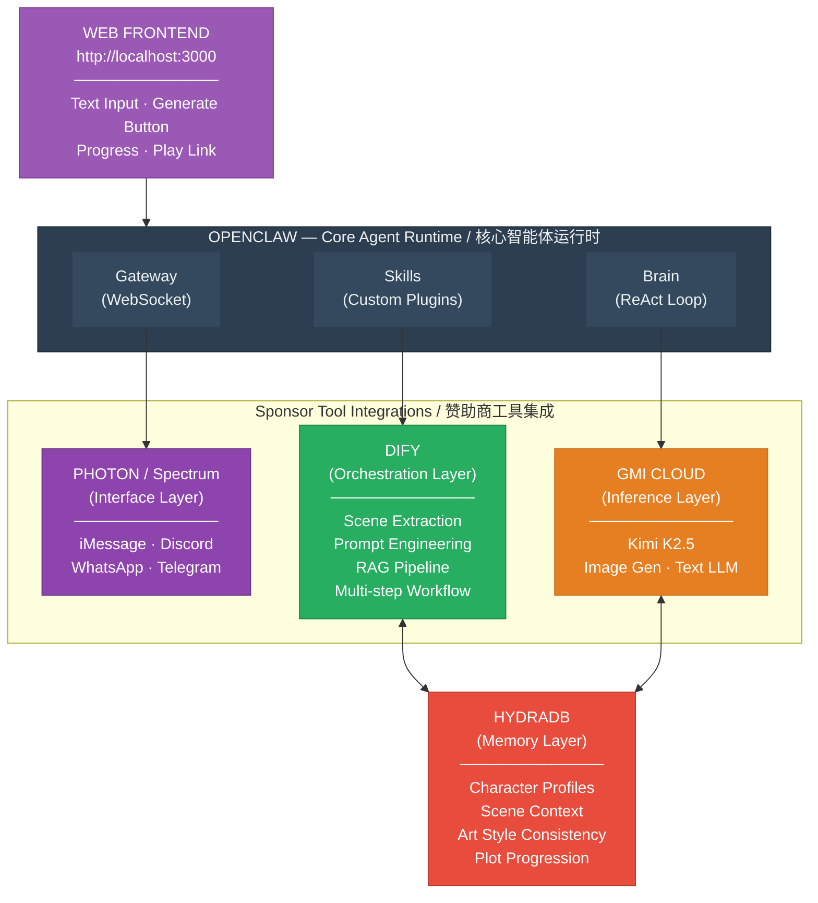
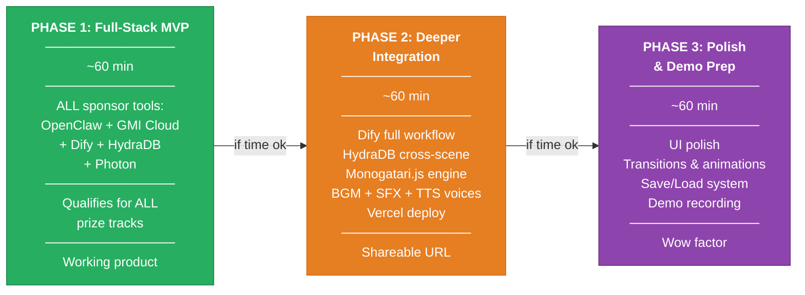
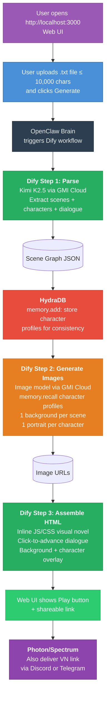
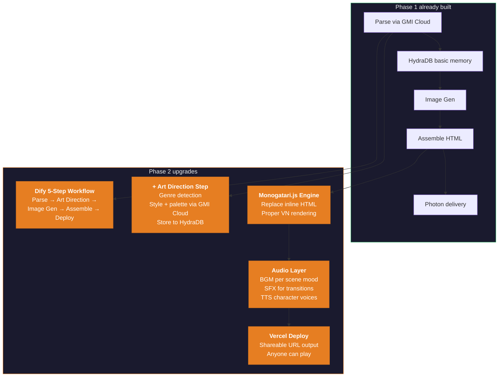
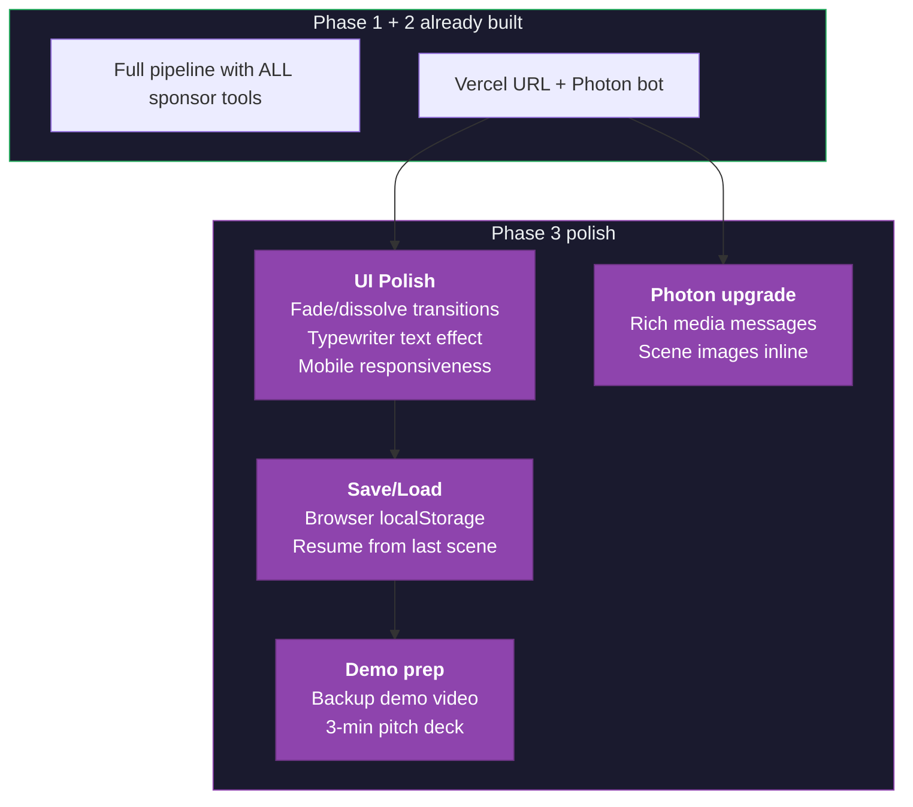
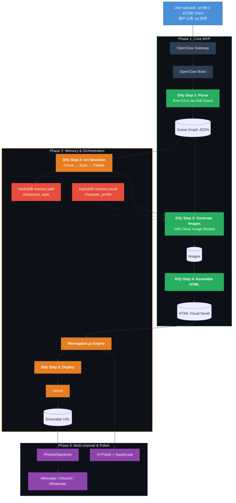

# Hongyang: Text Novel to Visual Novel Agent
# Hongyang：文字小说转视觉小说智能体

---

## Table of Contents / 目录

- [1. Product Overview / 产品概述](#1-product-overview--产品概述)
- [2. Hackathon Context / 黑客松背景](#2-hackathon-context--黑客松背景)
  - [2.1. Prize Tracks / 奖项赛道](#21-prize-tracks--奖项赛道)
- [3. Technology Stack / 技术栈](#3-technology-stack--技术栈)
  - [3.1. Architecture Diagram / 架构图](#31-architecture-diagram--架构图)
  - [3.2. Stack Breakdown / 技术栈分解](#32-stack-breakdown--技术栈分解)
- [4. Phase Overview / 阶段概览](#4-phase-overview--阶段概览)
  - [4.1. Phase Summary / 阶段总结](#41-phase-summary--阶段总结)
- [5. Phase 1: Full-Stack MVP / 第一阶段：全栈 MVP](#5-phase-1-full-stack-mvp--第一阶段全栈-mvp)
  - [5.1. Pipeline / 流水线](#51-pipeline--流水线)
  - [5.2. What You Build / 构建内容](#52-what-you-build--构建内容)
  - [5.3. Development Plan / 开发计划](#53-development-plan--开发计划)
  - [5.4. Done Criteria / 完成标准](#54-done-criteria--完成标准)
- [6. Phase 2: Deeper Integration / 第二阶段：深度集成](#6-phase-2-deeper-integration--第二阶段深度集成)
  - [6.1. Upgrades Over Phase 1 / 相比第一阶段的升级](#61-upgrades-over-phase-1--相比第一阶段的升级)
  - [6.2. Development Plan / 开发计划](#62-development-plan--开发计划)
  - [6.3. Done Criteria / 完成标准](#63-done-criteria--完成标准)
- [7. Phase 3: Polish & Demo Prep / 第三阶段：打磨与演示准备](#7-phase-3-polish--demo-prep--第三阶段打磨与演示准备)
  - [7.1. Polish Items / 打磨项目](#71-polish-items--打磨项目)
  - [7.2. Development Plan / 开发计划](#72-development-plan--开发计划)
  - [7.3. Done Criteria / 完成标准](#73-done-criteria--完成标准)
- [8. Full Data Flow (All 3 Phases) / 完整数据流](#8-full-data-flow-all-3-phases--完整数据流)
- [9. OpenClaw Integration Details / OpenClaw 集成细节](#9-openclaw-integration-details--openclaw-集成细节)
  - [9.1. OpenClaw Configuration / 配置](#91-openclaw-configuration--配置)
  - [9.2. Custom Skills / 自定义技能](#92-custom-skills--自定义技能)
- [10. Key API Integrations / 关键 API 集成](#10-key-api-integrations--关键-api-集成)
  - [10.1. GMI Cloud Inference API / GMI Cloud 推理 API](#101-gmi-cloud-inference-api--gmi-cloud-推理-api)
  - [10.2. HydraDB Memory API / HydraDB 记忆 API](#102-hydradb-memory-api--hydradb-记忆-api)
  - [10.3. Photon/Spectrum Delivery / Photon/Spectrum 交付](#103-photonspectrum-delivery--photonspectrum-交付)
- [11. Scene Graph Schema / 场景图模式](#11-scene-graph-schema--场景图模式)
- [12. Prompt Engineering / 提示词工程](#12-prompt-engineering--提示词工程)
  - [12.1. Scene Extraction Prompt / 场景提取提示词](#121-scene-extraction-prompt--场景提取提示词)
  - [12.2. Image Generation Prompt Template / 图像生成提示词模板](#122-image-generation-prompt-template--图像生成提示词模板)
- [13. Risk Mitigation / 风险缓解](#13-risk-mitigation--风险缓解)
- [14. Demo Strategy / 演示策略](#14-demo-strategy--演示策略)
  - [14.1. Demo Script / 演示脚本](#141-demo-script--演示脚本)
  - [14.2. Recommended Demo Text / 推荐演示文本](#142-recommended-demo-text--推荐演示文本)
- [15. Judging Optimization / 评审优化](#15-judging-optimization--评审优化)
- [16. Future Vision / 未来愿景](#16-future-vision--未来愿景)

---

## 1. Product Overview / 产品概述

Hongyang is an AI-powered agent that transforms plain text novel chapters into playable visual novel experiences. The agent runs as a web application at `http://localhost:3000`. Users open the link in their browser, upload a `.txt` file (up to 10,000 characters), and the agent automatically extracts scenes, generates character art and backgrounds, composes dialogue sequences, and outputs an interactive visual novel link that anyone can click and play.

Hongyang 是一款基于 AI 的智能体，能够将纯文本小说章节转化为可玩的视觉小说体验。智能体以 Web 应用的形式运行在 `http://localhost:3000`。用户在浏览器中打开链接，上传一个 `.txt` 文件（不超过 10,000 字符），智能体便会自动提取场景、生成角色立绘和背景图、编排对话序列，并输出一个可交互的视觉小说链接，任何人点击即可游玩。

---

## 2. Hackathon Context / 黑客松背景

**Event:** Total Agent Recall Hackathon
**Date:** March 28, 2026 | 10:00 AM – 6:00 PM PT
**Venue:** Sky9 Capital, 577 2nd St, San Francisco, CA 94107
**Build Time:** ~3 hours (11:30 AM – 4:00 PM, with lunch break)
**Team Size:** 2–4 recommended

**活动名称：** Total Agent Recall 黑客松
**日期：** 2026年3月28日 | 上午10:00 – 下午6:00（太平洋时间）
**地点：** Sky9 Capital, 577 2nd St, San Francisco, CA 94107
**开发时间：** 约3小时（11:30 AM – 4:00 PM，含午餐休息）
**团队规模：** 建议2–4人

### 2.1. Prize Tracks / 奖项赛道

| Prize | Reward | How We Qualify |
|-------|--------|----------------|
| Grand Prize | Mac Mini + $500 Amazon GC | Best overall agent |
| 2nd Place | $300 Amazon GC | — |
| 3rd Place | $150 Amazon GC | — |
| Best Dify Workflow | 12 months Dify Pro ($590) | Full Dify orchestration pipeline |
| Best Photon Interface | 1 month Photon line ($500) | Visual novel delivery via messaging |
| Best NVIDIA-Powered Agent on GMI Cloud | $100 credits/member | Kimi K2.5 on GMI Cloud inference |

| 奖项 | 奖品 | 我们如何获得资格 |
|-------|------|------------------|
| 最佳大奖 | Mac Mini + $500 亚马逊礼品卡 | 最佳整体智能体 |
| 第二名 | $300 亚马逊礼品卡 | — |
| 第三名 | $150 亚马逊礼品卡 | — |
| 最佳 Dify 工作流 | 12个月 Dify Pro（价值$590）| 完整的 Dify 编排流水线 |
| 最佳 Photon 交互界面 | 1个月 Photon 线路（价值$500）| 通过消息平台传递视觉小说 |
| 最佳 GMI Cloud NVIDIA 智能体 | 每名成员$100积分 | 使用 GMI Cloud 推理的 Kimi K2.5 |

---

## 3. Technology Stack / 技术栈

We maximize sponsor tool integration to qualify for every prize track, while using OpenClaw as our core agent framework.

我们最大化使用赞助商的工具集成以获得每个奖项赛道的参赛资格，同时使用 OpenClaw 作为核心智能体框架。

### 3.1. Architecture Diagram / 架构图



### 3.2. Stack Breakdown / 技术栈分解

| Layer | Technology | Role | Phase |
|-------|-----------|------|-------|
| **Web Frontend** | Next.js or Express | Web UI at `http://localhost:3000`: text input, generate button, progress display, play link | P1 |
| **Agent Framework** | OpenClaw | Core runtime: Gateway routing, Brain (ReAct reasoning), Skills (custom plugins), Heartbeat scheduling | P1 |
| **Inference** | GMI Cloud + Kimi K2.5 | LLM calls for text analysis, scene extraction, dialogue parsing; Image generation model calls for character art & backgrounds | P1 |
| **Orchestration** | Dify | Visual workflow builder for the multi-step pipeline: text ingestion → scene extraction → image prompt generation → asset creation → visual novel assembly | P1 (basic) → P2 (full 5-step) |
| **Memory** | HydraDB | Persistent memory for character consistency, art style decisions, scene-to-scene continuity, and plot progression | P1 (basic) → P2 (enriched) |
| **Interface** | Photon / Spectrum | Deliver the visual novel experience via Discord, Telegram, WhatsApp, or iMessage | P1 (basic bot) → P3 (rich media) |

| 层级 | 技术 | 角色 | 阶段 |
|------|------|------|------|
| **Web 前端** | Next.js 或 Express | 运行在 `http://localhost:3000` 的 Web UI：文本输入、生成按钮、进度显示、播放链接 | P1 |
| **智能体框架** | OpenClaw | 核心运行时：Gateway 路由、Brain（ReAct 推理）、Skills（自定义插件）、Heartbeat 调度 | P1 |
| **推理层** | GMI Cloud + Kimi K2.5 | 用于文本分析、场景提取、对话解析的 LLM 调用；用于角色立绘和背景图的图像生成模型调用 | P1 |
| **编排层** | Dify | 可视化工作流构建器，用于多步流水线：文本输入 → 场景提取 → 图像提示词生成 → 素材创建 → 视觉小说组装 | P1（基础）→ P2（完整5步）|
| **记忆层** | HydraDB | 持久化记忆，用于角色一致性、画风决策、场景间连续性和剧情推进 | P1（基础）→ P2（增强）|
| **交互层** | Photon / Spectrum | 通过 Discord、Telegram、WhatsApp 或 iMessage 提供视觉小说体验 | P1（基础机器人）→ P3（富媒体）|

---

## 4. Phase Overview / 阶段概览

The product is divided into 3 incremental phases. Each phase produces a **standalone, demoable product**. If time runs out, whatever phase you last completed is your final deliverable. **Critically, Phase 1 already integrates ALL 4 sponsor tools** (GMI Cloud, Dify, HydraDB, Photon) so you qualify for every prize track even if you only finish Phase 1.

产品分为 3 个递增阶段。每个阶段都产出一个**独立的、可演示的产品**。如果时间不够，你最后完成的阶段就是你的最终交付物。**关键是，第一阶段就已经集成了全部4个赞助商工具**（GMI Cloud、Dify、HydraDB、Photon），因此即使只完成第一阶段，你也能获得所有奖项赛道的参赛资格。



### 4.1. Phase Summary / 阶段总结

| | Phase 1: Full-Stack MVP | Phase 2: Deeper Integration | Phase 3: Polish & Demo Prep |
|---|---|---|---|
| **Time** | ~60 min | ~60 min | ~60 min |
| **Sponsor Tools** | ALL: OpenClaw, GMI Cloud, Dify, HydraDB, Photon | Same tools, deeper usage | Same tools, polished UX |
| **What it does** | Text → parse → store characters in HydraDB → generate images → assemble HTML VN → deliver via Photon | + Art direction, full Dify 5-step workflow, Monogatari.js engine, BGM + SFX + TTS character voices, Vercel URL | + Fade transitions, typewriter text, mobile responsive, save/load, demo video |
| **Deliverable** | Working web app + Photon messaging delivery | Vercel-hosted link + polished VN engine | Demo-ready product with wow factor |
| **Prize Tracks** | ALL: Grand Prize, Best NVIDIA Agent, Best Dify Workflow, Best Photon Interface | Same (deeper demos for each) | Same (polished demos for each) |

| | 第一阶段：全栈 MVP | 第二阶段：深度集成 | 第三阶段：打磨与演示准备 |
|---|---|---|---|
| **时间** | 约60分钟 | 约60分钟 | 约60分钟 |
| **赞助商工具** | 全部：OpenClaw、GMI Cloud、Dify、HydraDB、Photon | 同样工具，更深入使用 | 同样工具，打磨体验 |
| **功能** | 文本 → 解析 → 在 HydraDB 存储角色 → 生成图片 → 组装 HTML VN → 通过 Photon 交付 | + 美术指导、完整 Dify 5步工作流、Monogatari.js 引擎、BGM + 音效 + TTS 角色语音、Vercel 链接 | + 淡入过渡、打字机文本、移动端适配、存档/读档、演示视频 |
| **交付物** | 可运行的 Web 应用 + Photon 消息交付 | Vercel 托管链接 + 精美 VN 引擎 | 演示就绪的产品，带有惊艳因素 |
| **奖项赛道** | 全部：大奖、最佳 NVIDIA 智能体、最佳 Dify 工作流、最佳 Photon 交互界面 | 同（每项更深入演示）| 同（每项更打磨演示）|

---

## 5. Phase 1: Full-Stack MVP / 第一阶段：全栈 MVP

**Goal:** A working end-to-end pipeline that touches **ALL sponsor tools**. Even if this is the only phase you finish, judges from every sponsor company can see their product in action.

**目标：** 一个能跑通的端到端流水线，触及**全部赞助商工具**。即使这是你唯一完成的阶段，每家赞助商公司的评审都能看到他们的产品在实际运作。

### 5.1. Pipeline / 流水线



### 5.2. What You Build / 构建内容

| Component | Sponsor Tool | Details |
|-----------|-------------|---------|
| **Web Frontend** | — | A simple web page at `http://localhost:3000`. File upload input (`.txt`, max 10,000 chars), "Generate" button, progress spinner, "Play" link. Tech: Next.js or Express. |
| **OpenClaw project** | OpenClaw | Install OpenClaw, configure Brain to use GMI Cloud (Kimi K2.5). OpenClaw runs as the backend. |
| **Dify workflow** | **Dify** | A 3-step linear workflow: Parse → Generate Images → Assemble HTML. Basic but functional — shows Dify orchestration to the Dify judge. |
| **`novel-parser` skill** | **GMI Cloud** | Send text to Kimi K2.5 via GMI Cloud API. Receive structured scene graph JSON. Shows GMI Cloud inference to the GMI judge. |
| **`image-generator` skill** | **GMI Cloud** | Call GMI Cloud image generation API for backgrounds + character portraits. |
| **HydraDB memory** | **HydraDB** | After parsing, `memory.add()` stores character visual descriptions. Before image gen, `memory.recall()` retrieves them so character appearance stays consistent across scenes. Shows HydraDB to the HydraDB judge. |
| **`vn-assembler` skill** | — | JS/HTML template: scene graph + images → self-contained HTML visual novel. Served under `/vn/{id}`. |
| **Photon delivery** | **Photon** | Wire a basic Photon/Spectrum bot on Discord or Telegram. User sends `/novel [text]`, bot replies with the visual novel link. Shows Photon to the Photon judge. |

| 组件 | 赞助商工具 | 详情 |
|------|-----------|------|
| **Web 前端** | — | 运行在 `http://localhost:3000` 的简单网页。文件上传输入框（`.txt`，最多10,000字符）、"生成"按钮、进度转圈、"播放"链接。技术：Next.js 或 Express。|
| **OpenClaw 项目** | OpenClaw | 安装 OpenClaw，配置 Brain 使用 GMI Cloud（Kimi K2.5）。OpenClaw 作为后端运行。|
| **Dify 工作流** | **Dify** | 3步线性工作流：解析 → 生成图片 → 组装 HTML。基础但可用——向 Dify 评审展示 Dify 编排能力。|
| **`novel-parser` 技能** | **GMI Cloud** | 通过 GMI Cloud API 将文本发送给 Kimi K2.5。接收结构化场景图 JSON。向 GMI 评审展示 GMI Cloud 推理。|
| **`image-generator` 技能** | **GMI Cloud** | 调用 GMI Cloud 图像生成 API 生成背景 + 角色立绘。|
| **HydraDB 记忆** | **HydraDB** | 解析后，`memory.add()` 存储角色视觉描述。图像生成前，`memory.recall()` 检索以保持角色外观跨场景一致。向 HydraDB 评审展示 HydraDB。|
| **`vn-assembler` 技能** | — | JS/HTML 模板：场景图 + 图片 → 自包含的 HTML 视觉小说。在 `/vn/{id}` 下提供服务。|
| **Photon 交付** | **Photon** | 在 Discord 或 Telegram 上接入一个基础 Photon/Spectrum 机器人。用户发送 `/novel [文本]`，机器人回复视觉小说链接。向 Photon 评审展示 Photon。|

### 5.3. Development Plan (~60 min) / 开发计划（约60分钟）

| Time | Task | Description |
|------|------|-------------|
| 0:00–0:08 | **Setup** | `npm install -g openclaw@latest && openclaw onboard`. Configure GMI Cloud + HydraDB + Dify API keys. Scaffold web app, verify `localhost:3000`. |
| 0:08–0:15 | **Web Frontend** | File upload input (accept `.txt`), read file content client-side, "Generate" button, progress spinner, "Play" link. Wire POST `/api/generate` with file content. |
| 0:15–0:25 | **Novel Parser (GMI Cloud + Dify)** | Scene extraction prompt → Kimi K2.5 via GMI Cloud. Validate JSON. Wire as Dify Step 1. |
| 0:25–0:30 | **HydraDB Memory** | After parse, `memory.add()` character profiles. Before image gen, `memory.recall()` to get consistent descriptions. |
| 0:30–0:42 | **Image Generation (GMI Cloud)** | Image prompt templates from scene graph + recalled character profiles. Call GMI Cloud image API. Wire as Dify Step 2. |
| 0:42–0:50 | **VN Assembler (Dify)** | Minimal HTML template: full-screen bg, character portrait, dialogue box, click-to-advance JS. Serve under `/vn/{id}`. Wire as Dify Step 3. |
| 0:50–0:55 | **Photon Bot** | Install Spectrum SDK. Connect to Discord or Telegram. `/novel [text]` → trigger pipeline → reply with VN link. |
| 0:55–1:00 | **End-to-end test** | Test both paths: (1) `localhost:3000` web UI, (2) Discord `/novel` command. Verify VN plays in browser. |

| 时间 | 任务 | 描述 |
|------|------|------|
| 0:00–0:08 | **搭建环境** | `npm install -g openclaw@latest && openclaw onboard`。配置 GMI Cloud + HydraDB + Dify API 密钥。搭建 Web 应用，验证 `localhost:3000`。|
| 0:08–0:15 | **Web 前端** | 文件上传输入框（接受 `.txt`），客户端读取文件内容、"生成"按钮、进度转圈、"播放"链接。连接 POST `/api/generate` 传递文件内容。|
| 0:15–0:25 | **小说解析器（GMI Cloud + Dify）** | 场景提取提示词 → 通过 GMI Cloud 调用 Kimi K2.5。验证 JSON。接入 Dify 步骤1。|
| 0:25–0:30 | **HydraDB 记忆** | 解析后，`memory.add()` 存储角色档案。图像生成前，`memory.recall()` 获取一致的描述。|
| 0:30–0:42 | **图像生成（GMI Cloud）** | 从场景图 + 召回的角色档案构建图像提示词。调用 GMI Cloud 图像 API。接入 Dify 步骤2。|
| 0:42–0:50 | **VN 组装器（Dify）** | 最小化 HTML 模板：全屏背景、角色头像、对话框、点击推进 JS。在 `/vn/{id}` 下提供服务。接入 Dify 步骤3。|
| 0:50–0:55 | **Photon 机器人** | 安装 Spectrum SDK。连接 Discord 或 Telegram。`/novel [文本]` → 触发流水线 → 回复 VN 链接。|
| 0:55–1:00 | **端到端测试** | 测试两条路径：(1) `localhost:3000` Web UI，(2) Discord `/novel` 命令。验证 VN 在浏览器中可玩。|

### 5.4. Done Criteria / 完成标准

> **You can demo this to ALL judges:** Open `http://localhost:3000` → upload a `.txt` file → click "Generate" → VN plays in browser. **Also:** send `/novel` on Discord → bot replies with VN link. HydraDB stores character data for consistency. Dify orchestrates the pipeline. GMI Cloud powers both LLM and image gen. It works. It covers every sponsor.

> **你可以向所有评审演示：** 打开 `http://localhost:3000` → 上传 `.txt` 文件 → 点击"生成" → VN 在浏览器中可玩。**同时：** 在 Discord 发送 `/novel` → 机器人回复 VN 链接。HydraDB 存储角色数据以保持一致性。Dify 编排流水线。GMI Cloud 驱动 LLM 和图像生成。能用。覆盖每个赞助商。

---

## 6. Phase 2: Deeper Integration / 第二阶段：深度集成

**Goal:** Deepen the integration of every sponsor tool. Add an Art Direction step, upgrade Dify to a full 5-step workflow, use HydraDB for richer memory (art style + voice profiles), upgrade to Monogatari.js engine, add a full audio layer (BGM, SFX, TTS character voices), and deploy to Vercel for shareable URLs.

**目标：** 深化每个赞助商工具的集成。添加美术指导步骤，将 Dify 升级为完整的5步工作流，使用 HydraDB 实现更丰富的记忆（画风 + 语音档案），升级到 Monogatari.js 引擎，添加完整的音频层（BGM、音效、TTS 角色语音），并部署到 Vercel 生成可分享链接。

### 6.1. Upgrades Over Phase 1 / 相比第一阶段的升级



| Upgrade | From (P1) | To (P2) |
|---------|-----------|---------|
| **Dify workflow** | 3-step basic (Parse → Image → Assemble) | 5-step full (Parse → Art Direction → Image Gen → Assemble → Deploy) |
| **HydraDB usage** | Basic: store/recall character profiles | Richer: + art style decisions, scene context, color palettes, voice profiles |
| **Art Direction** | None (generic prompts) | New step: genre detection → art style selection → consistent color palette |
| **VN engine** | Inline HTML/JS (ugly but works) | Monogatari.js (proper VN experience, transitions, scene management, audio playback) |
| **Audio: BGM** | None (silent) | Ambient background music per scene mood (e.g., tense, romantic, calm). Use royalty-free tracks or AI-generated music matched to mood tag. |
| **Audio: SFX** | None | Sound effects for scene transitions (whoosh), dialogue advance (click/pop), and dramatic moments (thunder, door slam). |
| **Audio: Character Voices** | None | TTS-generated character voices via GMI Cloud or ElevenLabs. Each character gets a distinct voice. Dialogue lines are read aloud as text advances. |
| **Deployment** | Local `/vn/{id}` only | + Vercel auto-deploy → shareable URL anyone can click |
| **Photon** | Basic: reply with link | Same (already working from P1) |

| 升级项 | 从（P1）| 到（P2）|
|--------|---------|---------|
| **Dify 工作流** | 3步基础（解析 → 图像 → 组装）| 5步完整（解析 → 美术指导 → 图像生成 → 组装 → 部署）|
| **HydraDB 用法** | 基础：存储/召回角色档案 | 更丰富：+ 画风决策、场景上下文、配色方案、语音档案 |
| **美术指导** | 无（通用提示词）| 新步骤：类型检测 → 画风选择 → 一致的配色方案 |
| **VN 引擎** | 内联 HTML/JS（丑但能用）| Monogatari.js（正式 VN 体验、过渡效果、场景管理、音频播放）|
| **音频：BGM** | 无（静音）| 根据场景氛围的环境背景音乐（如紧张、浪漫、平静）。使用免版税音轨或根据氛围标签 AI 生成的音乐。|
| **音频：音效** | 无 | 场景过渡音效（呼啸声）、对话推进音效（点击/弹出声）、戏剧性时刻音效（雷声、关门声）。|
| **音频：角色语音** | 无 | 通过 GMI Cloud 或 ElevenLabs 生成 TTS 角色语音。每个角色获得独特的声音。对话行在文本推进时朗读。|
| **部署** | 仅本地 `/vn/{id}` | + Vercel 自动部署 → 可分享 URL，任何人可点击 |
| **Photon** | 基础：回复链接 | 同（P1 已可用）|

### 6.2. Development Plan (~60 min) / 开发计划（约60分钟）

| Time | Task | Description |
|------|------|-------------|
| 1:00–1:10 | **Art Direction step** | Add Dify Step 2: Kimi K2.5 detects genre → selects art style → generates color palette → assigns mood tags per scene. Store art style + mood to HydraDB. |
| 1:10–1:15 | **HydraDB enrichment** | Upgrade memory to also store art style decisions, scene mood, and character voice profiles. |
| 1:15–1:30 | **Monogatari.js migration** | Replace inline HTML with Monogatari.js. Map scene graph JSON → Monogatari script format. Linear scene progression with audio hooks. |
| 1:30–1:40 | **Audio: BGM + SFX** | Map scene mood tags to royalty-free BGM tracks (5-6 moods: tense, romantic, calm, action, mysterious, sad). Add SFX for transitions and dialogue. Bundle into Monogatari.js config. |
| 1:40–1:48 | **Audio: Character Voices** | For each dialogue line, call TTS API (GMI Cloud or ElevenLabs) with character-specific voice settings. Store voice config in HydraDB. Embed audio playback in Monogatari.js. |
| 1:48–1:53 | **Vercel deploy** | Set up Vercel CLI or API. Auto-deploy the generated VN package (with audio assets). Return shareable URL. Update web UI and Photon bot. |
| 1:53–2:00 | **End-to-end test** | Run full pipeline. Verify: shareable URL works, BGM plays per scene, character voices speak dialogue, SFX fires on transitions. |

| 时间 | 任务 | 描述 |
|------|------|------|
| 1:00–1:10 | **美术指导步骤** | 添加 Dify 步骤2：Kimi K2.5 检测类型 → 选择画风 → 生成配色方案 → 为每个场景分配氛围标签。将画风 + 氛围存储到 HydraDB。|
| 1:10–1:15 | **HydraDB 增强** | 升级记忆以同时存储画风决策、场景氛围和角色语音档案。|
| 1:15–1:30 | **Monogatari.js 迁移** | 用 Monogatari.js 替换内联 HTML。将场景图 JSON 映射为 Monogatari 脚本格式。带音频钩子的线性场景推进。|
| 1:30–1:40 | **音频：BGM + 音效** | 将场景氛围标签映射到免版税 BGM 音轨（5-6种氛围：紧张、浪漫、平静、动作、神秘、悲伤）。添加过渡和对话的音效。打包进 Monogatari.js 配置。|
| 1:40–1:48 | **音频：角色语音** | 对每行对话，使用角色特定的语音设置调用 TTS API（GMI Cloud 或 ElevenLabs）。将语音配置存储到 HydraDB。在 Monogatari.js 中嵌入音频播放。|
| 1:48–1:53 | **Vercel 部署** | 设置 Vercel CLI 或 API。自动部署生成的 VN 包（含音频资源）。返回可分享 URL。更新 Web UI 和 Photon 机器人。|
| 1:53–2:00 | **端到端测试** | 运行完整流水线。验证：可分享 URL 可用、BGM 按场景播放、角色语音朗读对话、音效在过渡时触发。|

### 6.3. Done Criteria / 完成标准

> **Upgrade over Phase 1:** Paste text → receive a Vercel URL → share it with anyone → they click and play a polished visual novel with consistent art style, character portraits, BGM that matches scene mood, sound effects, and TTS character voices reading dialogue aloud. Dify shows a full 5-step workflow. HydraDB stores richer context including voice profiles.

> **相比第一阶段的提升：** 粘贴文本 → 收到一个 Vercel URL → 分享给任何人 → 他们点击就能玩一个画风一致、有角色立绘、BGM 匹配场景氛围、有音效、TTS 角色语音朗读对话的精美视觉小说。Dify 展示完整的5步工作流。HydraDB 存储更丰富的上下文（含语音档案）。

---

## 7. Phase 3: Polish & Demo Prep / 第三阶段：打磨与演示准备

**Goal:** Make it impressive. Polish the visual novel UI, add quality-of-life features, and prepare the demo. This phase is about "wow factor" — if you only finished Phase 2, you already have a solid product. Phase 3 makes judges say "wow."

**目标：** 让它令人印象深刻。打磨视觉小说 UI，添加体验提升功能，准备演示。这个阶段是关于"惊艳因素"——如果你只完成了第二阶段，你已经有一个扎实的产品了。第三阶段让评审说"哇"。

### 7.1. Polish Items / 打磨项目



| Item | Details |
|------|---------|
| **UI polish** | Fade/dissolve scene transitions, typewriter text effect, character sprite animations, mobile-responsive layout. |
| **Save/Load** | Browser localStorage-based save system. Players can close the tab and resume from where they left off. |
| **Photon upgrade** | Upgrade the basic Photon bot to send rich media (scene images + text) directly in Discord/Telegram, not just a link. |
| **Demo prep** | Record backup demo video. Prepare 3-minute pitch deck. Select best demo text excerpt. |

| 项目 | 详情 |
|------|------|
| **UI 打磨** | 淡入/淡出场景过渡、打字机文本效果、角色立绘动画、移动端响应式布局。|
| **存档/读档** | 基于浏览器 localStorage 的存档系统。玩家可关闭标签页后从上次位置继续。|
| **Photon 升级** | 升级基础 Photon 机器人，在 Discord/Telegram 中直接发送富媒体（场景图片 + 文本），而非仅发链接。|
| **演示准备** | 录制备用演示视频。准备3分钟演示 PPT。选择最佳演示文本节选。|

### 7.2. Development Plan (~60 min) / 开发计划（约60分钟）

| Time | Task | Description |
|------|------|-------------|
| 2:00–2:20 | **UI Polish** | Add CSS transitions between scenes. Implement typewriter text effect. Test on mobile viewport. |
| 2:20–2:30 | **Save/Load** | Add localStorage save on scene change. Add "Continue" button on title screen. |
| 2:30–2:40 | **Photon upgrade** | Upgrade bot to send scene images + text as rich media in Discord/Telegram, not just link. |
| 2:40–2:50 | **Final testing** | End-to-end test with 2-3 different novel excerpts via web + messaging. Fix any bugs. |
| 2:50–3:00 | **Demo prep** | Record backup demo video. Select best demo excerpt. Prepare pitch deck. |

| 时间 | 任务 | 描述 |
|------|------|------|
| 2:00–2:20 | **UI 打磨** | 添加场景间 CSS 过渡。实现打字机文本效果。在移动端视口测试。|
| 2:20–2:30 | **存档/读档** | 在场景切换时添加 localStorage 存档。在标题画面添加"继续"按钮。|
| 2:30–2:40 | **Photon 升级** | 升级机器人在 Discord/Telegram 中发送场景图片 + 文本作为富媒体，而非仅链接。|
| 2:40–2:50 | **最终测试** | 通过网页 + 消息平台用2-3段不同小说节选进行端到端测试。修复任何 bug。|
| 2:50–3:00 | **演示准备** | 录制备用演示视频。选择最佳演示节选。准备演示 PPT。|

### 7.3. Done Criteria / 完成标准

> **Wow factor:** Polished VN with smooth transitions, typewriter text, save/load. Photon bot sends rich scene previews in Discord. Backup demo video ready. You're confident for the 3-minute pitch.

> **惊艳因素：** 精美的 VN，流畅过渡、打字机文本、存档/读档。Photon 机器人在 Discord 中发送丰富的场景预览。备用演示视频就绪。你对3分钟演示充满信心。

---

## 8. Full Data Flow (All 3 Phases) / 完整数据流（全部3个阶段）

The diagram below shows the complete pipeline when all 3 phases are implemented. Phase labels indicate when each component is built.

下图展示了当全部3个阶段实现后的完整流水线。阶段标签指示每个组件的构建时间。



---

## 9. OpenClaw Integration Details / OpenClaw 集成细节

OpenClaw serves as the master agent framework, coordinating all sponsor tools through its modular architecture.

OpenClaw 作为主智能体框架，通过其模块化架构协调所有赞助商工具。

### 9.1. OpenClaw Configuration / 配置

```yaml
# ~/.openclaw/config.yaml
brain:
  provider: gmi-cloud           # Use GMI Cloud as LLM backend
  model: kimi-k2.5              # Moonshot's multimodal agentic model
  api_endpoint: https://api.gmicloud.ai/v1

skills:
  - name: novel-parser
    type: custom
    description: "Extract scenes, characters, dialogue from novel text"
    workflow: dify               # Delegates to Dify workflow

  - name: image-generator
    type: custom
    description: "Generate visual novel assets via GMI Cloud"
    api: gmi-cloud-image

  - name: vn-assembler
    type: custom
    description: "Assemble visual novel HTML package"
    runtime: node

  - name: photon-deliver
    type: custom
    description: "Deliver visual novel via Photon/Spectrum"
    framework: spectrum

memory:
  provider: hydradb              # Use HydraDB instead of default markdown
  api_key: ${HYDRADB_API_KEY}
  memory_types:
    - user_memories              # Reader preferences
    - knowledge_memories         # Novel content & world-building
```

### 9.2. Custom Skills / 自定义技能

We build 4 custom OpenClaw skills, each wrapping a sponsor tool:

我们构建 4 个自定义 OpenClaw 技能，每个封装一个赞助商工具：

| Skill | Sponsor Tool | Function | Phase |
|-------|-------------|----------|-------|
| `novel-parser` | Dify + GMI Cloud | Calls Dify workflow → Kimi K2.5 via GMI Cloud to parse novel text into structured scene graph | P1 |
| `image-generator` | GMI Cloud + HydraDB | Recalls character profiles from HydraDB, then calls GMI Cloud image gen API | P1 |
| `vn-assembler` | — (built-in) | Assembles HTML visual novel from scene graph + generated assets | P1 |
| `photon-deliver` | Photon/Spectrum | Delivers the visual novel link to messaging platforms via Spectrum | P1 |

| 技能 | 赞助商工具 | 功能 | 阶段 |
|------|-----------|------|------|
| `novel-parser` | Dify + GMI Cloud | 调用 Dify 工作流 → 通过 GMI Cloud 调用 Kimi K2.5 将小说文本解析为结构化场景图 | P1 |
| `image-generator` | GMI Cloud + HydraDB | 从 HydraDB 召回角色档案，然后调用 GMI Cloud 图像生成 API | P1 |
| `vn-assembler` | —（内置）| 从场景图 + 生成素材组装 HTML 视觉小说 | P1 |
| `photon-deliver` | Photon/Spectrum | 通过 Spectrum 将视觉小说链接交付到消息平台 | P1 |

---

## 10. Key API Integrations / 关键 API 集成

### 10.1. GMI Cloud Inference API (Phase 1) / GMI Cloud 推理 API（第一阶段）

```python
import requests

GMI_API_BASE = "https://api.gmicloud.ai/v1"
GMI_API_KEY = os.environ["GMI_API_KEY"]

# Text analysis with Kimi K2.5
def parse_novel(text: str) -> dict:
    response = requests.post(
        f"{GMI_API_BASE}/chat/completions",
        headers={"Authorization": f"Bearer {GMI_API_KEY}"},
        json={
            "model": "kimi-k2.5",
            "messages": [
                {"role": "system", "content": SCENE_EXTRACTION_PROMPT},
                {"role": "user", "content": text}
            ],
            "response_format": {"type": "json_object"}
        }
    )
    return response.json()["choices"][0]["message"]["content"]

# Image generation
def generate_image(prompt: str) -> str:
    response = requests.post(
        f"{GMI_API_BASE}/images/generations",
        headers={"Authorization": f"Bearer {GMI_API_KEY}"},
        json={
            "model": "stable-diffusion-xl",  # or available image model
            "prompt": prompt,
            "size": "1280x720",              # 16:9 for backgrounds
            "n": 1
        }
    )
    return response.json()["data"][0]["url"]
```

### 10.2. HydraDB Memory API (Phase 2) / HydraDB 记忆 API（第二阶段）

```python
import requests

HYDRA_API_BASE = "https://api.hydradb.com/v1"
HYDRA_API_KEY = os.environ["HYDRADB_API_KEY"]

# Store character profile
def store_character(character: dict):
    requests.post(
        f"{HYDRA_API_BASE}/memory/add",
        headers={"Authorization": f"Bearer {HYDRA_API_KEY}"},
        json={
            "content": f"Character: {character['name']}. {character['description']}",
            "metadata": {"type": "character", "name": character["name"]},
            "infer": True  # Extract latent signals
        }
    )

# Recall character for consistency
def recall_character(name: str) -> str:
    response = requests.post(
        f"{HYDRA_API_BASE}/memory/recall",
        headers={"Authorization": f"Bearer {HYDRA_API_KEY}"},
        json={"query": f"Visual appearance of character {name}"}
    )
    return response.json()["memories"]
```

### 10.3. Photon/Spectrum Delivery (Phase 3) / Photon/Spectrum 交付（第三阶段）

```typescript
import { Spectrum } from '@photon/spectrum';

const agent = new Spectrum({
  channels: ['discord', 'imessage'],
});

agent.on('message', async (msg) => {
  if (msg.text.startsWith('/novel')) {
    const novelText = msg.text.replace('/novel ', '');
    const vnUrl = await generateVisualNovel(novelText);

    await msg.reply({
      text: `Your visual novel is ready! Click to play:`,
      attachments: [{ type: 'link', url: vnUrl }]
    });
  }
});
```

---

## 11. Scene Graph Schema / 场景图模式

The intermediate scene graph JSON is the core data structure that connects all pipeline stages.

中间场景图 JSON 是连接所有流水线阶段的核心数据结构。

```json
{
  "title": "Chapter 1: The Beginning",
  "art_style": "anime",
  "color_palette": ["#2C3E50", "#E74C3C", "#ECF0F1"],
  "characters": [
    {
      "id": "char_01",
      "name": "Elena",
      "description": "Young woman with silver hair, blue eyes, wearing a dark cloak",
      "image_prompt": "anime style portrait, young woman, silver hair, blue eyes, dark cloak, detailed, high quality",
      "image_url": null
    }
  ],
  "scenes": [
    {
      "id": "scene_01",
      "location": "Ancient forest clearing",
      "time_of_day": "twilight",
      "mood": "mysterious",
      "background_prompt": "anime style, ancient forest clearing at twilight, mysterious atmosphere, purple sky, tall trees",
      "background_url": null,
      "dialogue": [
        {"speaker": "char_01", "text": "I never thought I'd return to this place..."},
        {"speaker": "narrator", "text": "The wind carried whispers of forgotten memories."},
        {"speaker": "char_01", "text": "But some things cannot stay buried forever."}
      ],
      "next_scene": "scene_02"
    }
  ]
}
```

---

## 12. Prompt Engineering / 提示词工程

The quality of the visual novel depends heavily on prompt engineering. Here are the key prompts.

视觉小说的质量在很大程度上取决于提示词工程。以下是关键提示词。

### 12.1. Scene Extraction Prompt / 场景提取提示词

```
You are a visual novel director. Analyze the following novel text and extract a structured scene graph.

For each scene, identify:
1. Location and setting
2. Time of day and lighting
3. Mood/atmosphere
4. Characters present (with physical descriptions)
5. Dialogue (with speaker attribution)
Rules:
- Extract 5-8 scenes maximum
- Scenes must follow a linear progression (no branching)
- Each scene should have 3-8 lines of dialogue
- Character descriptions must be consistent across scenes
- Output valid JSON matching the provided schema

Novel text:
{input_text}
```

### 12.2. Image Generation Prompt Template / 图像生成提示词模板

```
{art_style} style, {scene_description}, {time_of_day} lighting,
{mood} atmosphere, detailed background, visual novel game asset,
high quality, no text, no UI elements, 16:9 aspect ratio
```

---

## 13. Risk Mitigation / 风险缓解

| Risk | Phase | Probability | Impact | Mitigation |
|------|-------|------------|--------|------------|
| Image generation too slow | P1 | High | High | Pre-generate a set of generic backgrounds; use lower resolution (512x512); batch requests |
| GMI Cloud API issues | P1 | Medium | Critical | Have OpenAI/Anthropic API keys as fallback; cache successful responses |
| Dify workflow complexity | P2 | Medium | Medium | Start with a simple linear workflow in P1; add complexity only in P2 |
| Visual novel assembly bugs | P1 | Medium | Medium | Use Monogatari.js defaults in P2; minimal inline HTML in P1; test with hardcoded data first |
| HydraDB latency | P2 | Low | Low | Memory recall is non-blocking; fall back to in-memory cache if needed |
| Photon integration complexity | P3 | Medium | Low | Photon is Phase 3 — only attempt after P1+P2 are solid; focus on web link delivery first |

| 风险 | 阶段 | 概率 | 影响 | 缓解措施 |
|------|------|------|------|----------|
| 图像生成太慢 | P1 | 高 | 高 | 预生成一组通用背景；使用低分辨率（512x512）；批量请求 |
| GMI Cloud API 问题 | P1 | 中 | 严重 | 准备 OpenAI/Anthropic API 密钥作为备选；缓存成功响应 |
| Dify 工作流复杂度 | P2 | 中 | 中 | P1 从简单线性工作流开始；仅在 P2 增加复杂度 |
| 视觉小说组装 bug | P1 | 中 | 中 | P2 使用 Monogatari.js 默认设置；P1 用最小化内联 HTML；先用硬编码数据测试 |
| HydraDB 延迟 | P2 | 低 | 低 | 记忆召回为非阻塞操作；必要时回退到内存缓存 |
| Photon 集成复杂度 | P3 | 中 | 低 | Photon 在第三阶段——仅在 P1+P2 稳固后尝试；优先确保网页链接交付 |

---

## 14. Demo Strategy / 演示策略

For the 3-minute demo, we prepare a compelling narrative:

3分钟演示中，我们准备一个引人入胜的叙事：

### 14.1. Demo Script / 演示脚本

1. **Hook (30s):** "Everyone loves novels. But what if you could turn any chapter into a visual novel you can play — in under 60 seconds?"

   **开场（30秒）：** "每个人都喜欢小说。但如果你能在60秒内把任何章节变成一个可以玩的视觉小说呢？"

2. **Live Demo (90s):** Upload a `.txt` file of a chapter excerpt from a well-known novel → show the agent processing in real-time → click the generated link → play through 2-3 scenes of the visual novel

   **现场演示（90秒）：** 上传一段知名小说的章节节选 `.txt` 文件 → 展示智能体实时处理过程 → 点击生成的链接 → 玩2-3个场景的视觉小说

3. **Tech Deep Dive (30s):** Quick architecture slide showing all 4 sponsor tools working together through OpenClaw

   **技术深入（30秒）：** 快速展示架构图，显示所有4个赞助商工具如何通过 OpenClaw 协同工作

4. **Impact & Vision (30s):** "This isn't just a demo. Web novels are a $30B market. Visual novels engage 4x longer. Hongyang bridges the gap — any author, any story, instant visual novel."

   **影响力与愿景（30秒）：** "这不仅是一个演示。网络小说是一个300亿美元的市场。视觉小说的用户参与时长是4倍。Hongyang 弥合了这一差距——任何作者、任何故事，即时视觉小说。"

### 14.2. Recommended Demo Text / 推荐演示文本

Choose a dramatic, character-rich excerpt (500–1,000 words) from a public domain novel such as:
- *Alice's Adventures in Wonderland* — vivid scenes, distinct characters
- *The Great Gatsby* — atmospheric, emotional dialogue
- A custom-written original excerpt (avoids copyright concerns entirely)

选择一段戏剧性强、角色丰富的公共领域小说节选（500–1,000词），例如：
- 《爱丽丝漫游奇境记》——场景生动，角色鲜明
- 《了不起的盖茨比》——氛围感强，情感对话丰富
- 自行撰写的原创节选（完全避免版权问题）

---

## 15. Judging Optimization / 评审优化

Based on the judge panel, here is how we tailor our presentation:

根据评审团构成，以下是我们如何调整演示：

| Judge | Affiliation | What They Care About | How We Appeal |
|-------|-------------|---------------------|---------------|
| Yijie Hong | Director of Engineering, GMI Cloud | GPU utilization, inference performance | Show Kimi K2.5 multimodal capabilities, highlight inference speed |
| Scarlett Mao | Ecosystem PM, Dify | Workflow creativity, platform adoption | Showcase the full Dify pipeline with RAG + multi-step orchestration |
| Nishkarsh Srivastava | Founder/CEO, HydraDB | Memory architecture, agent statefulness | Demonstrate cross-session character consistency via HydraDB memories |
| Julie Chen & Ryan Zhu | Photon Growth & CTO | Interface innovation, user experience | Show visual novel delivery on iMessage/Discord via Spectrum |
| Arjun Chakraborty | Microsoft Security AI | Security, robustness | Mention input sanitization, prompt injection prevention |
| Kingsong Chen | YC16, QuoteTurn | Product-market fit, business viability | Emphasize the $30B web novel market opportunity |
| Sachin Gupta | Staff SWE, eBay | Engineering quality, scalability | Clean architecture, modular design |
| Thiyagarajan P. | Senior Applied Scientist, Amazon | ML/AI innovation | Novel use of multimodal models for creative content generation |
| Xiya Tang | AI Product Designer | UX, design quality | Beautiful visual novel output, intuitive interaction flow |

| 评审 | 所属机构 | 关注点 | 我们的应对策略 |
|------|---------|--------|---------------|
| 洪一杰 | GMI Cloud 工程总监 | GPU利用率、推理性能 | 展示 Kimi K2.5 多模态能力，强调推理速度 |
| 毛思佳 | Dify 生态产品经理 | 工作流创意、平台采用 | 展示完整的 Dify 流水线（RAG + 多步编排） |
| Nishkarsh Srivastava | HydraDB 创始人/CEO | 记忆架构、智能体状态保持 | 演示通过 HydraDB 记忆实现的跨会话角色一致性 |
| Julie Chen & Ryan Zhu | Photon 增长 & CTO | 交互创新、用户体验 | 展示通过 Spectrum 在 iMessage/Discord 上的视觉小说交付 |
| Arjun Chakraborty | 微软安全AI | 安全性、鲁棒性 | 提及输入清理、提示词注入防护 |
| Kingsong Chen | YC16, QuoteTurn | 产品市场匹配、商业可行性 | 强调300亿美元的网络小说市场机会 |
| Sachin Gupta | eBay 高级工程师 | 工程质量、可扩展性 | 清晰的架构、模块化设计 |
| Thiyagarajan P. | 亚马逊高级应用科学家 | ML/AI 创新 | 多模态模型在创意内容生成中的新颖应用 |
| 唐希雅 | AI 产品设计师 | 用户体验、设计质量 | 精美的视觉小说输出、直观的交互流程 |

---

## 16. Future Vision / 未来愿景（黑客松之后）

If the project succeeds, here is the roadmap beyond the hackathon:

如果项目成功，以下是黑客松之后的路线图：

- **Multi-chapter support:** Process entire novels with persistent character consistency across chapters via HydraDB
- **Voice acting:** Integrate TTS models (ElevenLabs) for character voiceovers
- **Animation:** Add Live2D-style character animations
- **User customization:** Let readers choose art styles, character appearances before generation
- **Monetization:** SaaS model for web novel platforms (Wattpad, Royal Road, Qidian)
- **Multi-language:** Support Chinese, Japanese, Korean novels with localized art styles

- **多章节支持：** 通过 HydraDB 处理完整小说，跨章节保持角色一致性
- **语音演技：** 集成 TTS 模型（ElevenLabs）用于角色配音
- **动画效果：** 添加 Live2D 风格的角色动画
- **用户自定义：** 让读者在生成前选择画风、角色外观
- **商业化：** 面向网络小说平台（Wattpad、Royal Road、起点中文网）的 SaaS 模型
- **多语言：** 支持中文、日文、韩文小说，配合本地化画风

---

*Document generated for Total Agent Recall Hackathon — March 28, 2026*
*本文档为 Total Agent Recall 黑客松生成 — 2026年3月28日*
